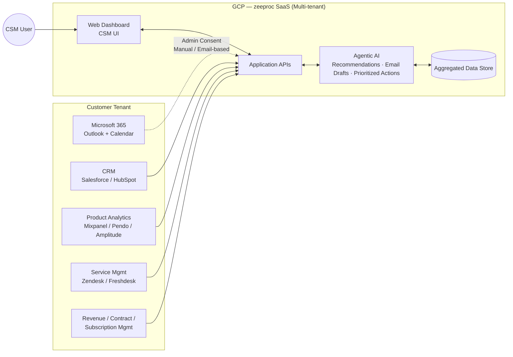
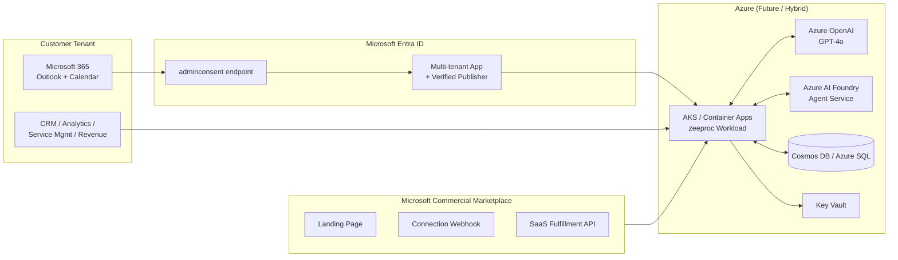
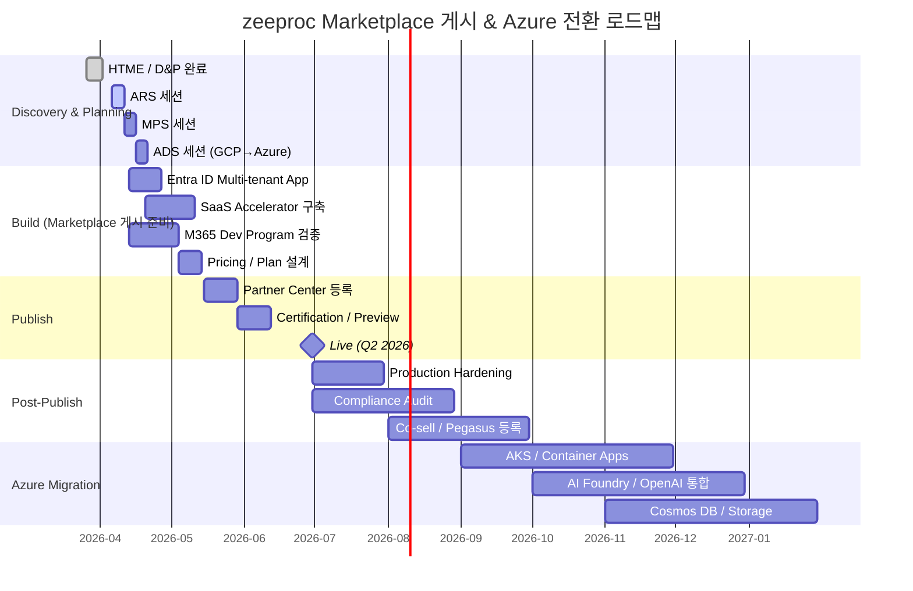
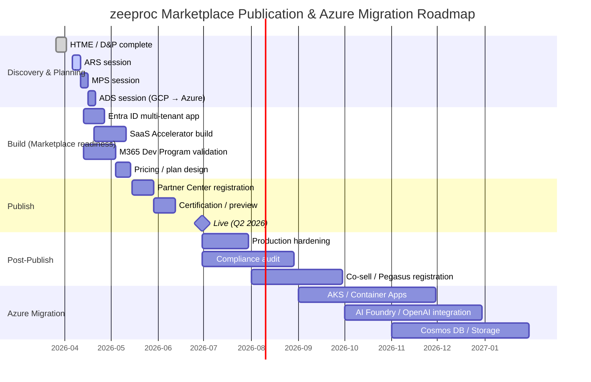

# AGENTWARE AI TECHNOLOGIES PRIVATE LIMITED — Scope 분석 결과

> **Source**: `1. Scope.md`  
> **Prompt**: `1. Scope_prompt.md`  
> **Engagement**: ME-124326 (ARS) · PRE-361041  
> **Solution**: zeeproc — Agentic AI Customer Success Platform

---

## 1. Partner Info

| Field | Value |
| --- | --- |
| **Account** | AGENTWARE AI TECHNOLOGIES PRIVATE LIMITED |
| **Solution Name** | zeeproc |
| **Country** | India |
| **Industry** | Agentic AI SaaS — B2B Customer Success Platform (Onboarding · Health Monitoring · Advocacy · Renewals · Expansion) |
| **Engagement Manager** | Douglas Tan Yan Hao (`v-tanyanhaod@microsoft.com`) |
| **Technical Account Lead** | — |
| **Primary Contact** | Mr Kumar Rajendran (`kumar@zeeproc.com`, +91-9632273344) |
| **Secondary Contact** | Aryan Singla (`aryan@zeeproc.com`) |
| **Current Marketplace Status** | Legal Verification: **Authorized**. Build & Publish 신규 Engagement (Outreach 1). Offer 미게시. |
| **Current Hosting** | Google Cloud Platform (GCP) — multi-tenant SaaS, 자체 컨테이너 |
| **Future Plan** | Azure 마이그레이션 9–12개월 내 검토. **Q2 2026** Microsoft Commercial Marketplace에 Transactable SaaS Offer (Get it now) 게시 |
| **Target Customers** | SMB ~ Mid-market B2B 조직 (Customer Success 팀 보유) |
| **Engagement Stage** | D&P 진행 중 (HTFollowingSessions — Syafiqah, 26/03 완료). **ARS 세션 요청 06/04 – 10/04** |

### 현재 아키텍처 개요 (As-Is)

---

## 2. Situation — Problem

파트너가 해결하고자 하는 핵심 문제를 다음과 같이 분해함.

### 2.1 Microsoft Entra ID 관리자 동의(admin consent) 흐름의 마찰
- **Root cause**: Outlook/Calendar 통합 시 multi-tenant 애플리케이션이 Microsoft Entra ID에 정식 등록되지 않아, 고객 테넌트 관리자가 **메일 기반으로 수동 승인**하는 방식에 의존.
- **Impact**: 고객 onboarding 단계 마찰 증가 → drop-off rate 상승, enterprise 고객 채택 지연. 다중 mailbox/calendar 권한을 일괄 승인할 수 있는 표준 admin consent 경험 부재.

### 2.2 Microsoft 365 Developer Program / Toolkit 접근 미확보
- **Root cause**: Entra ID 통합 흐름의 검증·테스트를 수행할 격리된 테넌트 환경이 없음. Developer Program 가입이 진행 중이나 **Block 상태**.
- **Impact**: 통합 검증 및 admin consent 흐름의 end-to-end 테스트 진행 불가. Marketplace 게시 일정에 영향.

### 2.3 GCP 호스팅 상태에서의 Marketplace 적합성 미확인
- **Root cause**: 솔루션이 GCP에 호스팅된 상태로, Marketplace 게시 정책(특히 *Azure value-add* 항목) 및 Transactable SaaS Offer 요건과의 정합성이 검증되지 않음.
- **Impact**: 게시 가능 여부 불확실 → ARS에서 architecture/AI 사용에 대한 검증이 선행되어야 함.

### 2.4 Agentic AI 아키텍처의 Microsoft 정렬 부재
- **Root cause**: AI Agent(데이터 분석, recommendation 생성, 이메일 초안, prioritized action surfacing)가 자체 모델/스택으로 구현되어, **Azure AI Foundry / Azure OpenAI / Microsoft 365 Copilot 생태계와의 통합 포인트 미명시**.
- **Impact**: ISV AI 프로그램 (AI Sprint, Pegasus, Azure credits) 혜택 활용 어려움. Microsoft Co-sell motion 약화.

### 2.5 Transactable SaaS Offer 기술 요건 미준비
- **Root cause**: Landing Page URL, Connection Webhook, SaaS Fulfillment API, Entra ID Tenant ID/Application ID 등 Transactable Offer **핵심 기술 자산 미구축/미검증**.
- **Impact**: Partner Center 등록 단계에서 Technical Configuration 통과 지연. **Q2 2026 게시 목표 risk**.

### 2.6 GCP → Azure 마이그레이션 로드맵 미수립
- **Root cause**: 9–12개월 내 마이그레이션 의향은 있으나 Compute/Storage/Networking/AI/Container 단위의 service mapping 및 단계별 계획 부재.
- **Impact**: ADS 세션을 통한 마이그레이션 청사진 확보 필요. 게시 후 long-term Azure consumption 전환 전략 부재.

### 문제 요약

| # | Problem | Severity | Engagement |
| --- | --- | --- | --- |
| 2.1 | Entra ID Admin Consent 마찰 | High | ARS |
| 2.2 | M365 Developer Program 미확보 | High | EM Action |
| 2.3 | GCP 호스팅 Marketplace 정합성 | Medium | ARS / MPS |
| 2.4 | Agentic AI Microsoft 정렬 부재 | Medium | ARS |
| 2.5 | Transactable SaaS 기술 자산 미준비 | High | MPS |
| 2.6 | GCP → Azure 마이그레이션 로드맵 부재 | Medium | ADS |

---

## 3. Task — Suggestion

각 문제에 대응하는 실행 가능한 Microsoft 정렬 권고안.

### 3.1 Entra ID Multi-tenant App Registration 표준화
- **Action**: zeeproc 애플리케이션을 Microsoft Entra ID에 **multi-tenant 애플리케이션**으로 등록. Microsoft Graph 필요 권한(`Mail.Read`, `Mail.Send`, `Calendars.ReadWrite` 등) 정의. **Admin consent endpoint** (`/adminconsent`) 또는 admin consent URL을 사용하여 테넌트 관리자가 단일 화면에서 권한을 일괄 승인하도록 구성. 가능 시 **Verified Publisher** 등록까지 진행.
- **Why**: Microsoft가 공식 권고하는 multi-tenant SaaS 인증 패턴. 고객 onboarding 마찰 제거 및 enterprise IT 정책 준수. Verified Publisher는 동의 화면 신뢰도를 높여 conversion에 기여.

### 3.2 Microsoft 365 Developer Program 접근 확보
- **Action**: Engagement Manager(Douglas)를 통해 M365 Developer Program 가입 가속. **Developer Tenant + 25 라이선스 + Sample Data Pack**을 활용해 Outlook/Calendar 통합 흐름과 admin consent를 격리 환경에서 검증.
- **Why**: Production 테넌트 영향 없이 admin consent 흐름·Graph API 통합·permission 변경을 안전하게 검증 가능. Marketplace 게시 전 필수 검증 환경.

### 3.3 GCP 호스팅 상태에서 Transactable SaaS Offer 게시 진행
- **Action**: Marketplace 정책상 SaaS Offer는 호스팅 위치에 무관하게 게시 가능함을 활용해 **ARS 통과를 우선 목표**로 설정. ARS 시 (a) AI 사용 명세 (b) 데이터 흐름 (c) Microsoft 365 통합 경계 (d) Marketplace 게시 정책 준수 항목을 정리해 제출.
- **Why**: GCP 호스팅이 게시의 절대적 차단 요인이 아님 → Q2 2026 게시 목표를 유지하면서 Azure 마이그레이션을 병행 가능. ARS 통과 후 MPS로 자연스럽게 이동.

### 3.4 Azure-native AI 서비스 통합 포인트 식별 (점진적)
- **Action**:
  - Insight/Recommendation 요약 생성 → **Azure OpenAI Service** (GPT-4o / GPT-4o-mini)
  - Agent orchestration → **Azure AI Foundry Agent Service** / Semantic Kernel
  - 모델 운영(평가·모니터링) → **Azure AI Foundry** (Evaluations, Tracing)
  - Microsoft 365 / Copilot 생태계 확장 → **Microsoft 365 Agents Toolkit** / Copilot Studio 검토
- **Why**: Azure-native AI를 한 컴포넌트라도 채택 시 ISV AI 프로그램 혜택(크레딧, AI Sprint, Pegasus) 자격 확보. ARS의 *Azure value-add* 항목 충족, Co-sell motion 활성화.

### 3.5 Transactable SaaS Offer 기술 자산 구축 — SaaS Accelerator 활용
- **Action**: 자체 구현 부담 최소화를 위해 **Microsoft Commercial-Marketplace-SaaS-Accelerator** (C# / ASP.NET MVC) 채택. Landing Page + Subscription Webhook + Admin Portal + SaaS API Emulator 일괄 확보. Pricing은 **Per User (CSM 좌석 기반) Flat Rate** 1차 권고, **Custom Meter Dimension**(처리된 이메일/계정 수)으로 확장 옵션 설계.
- **Why**: SaaS Accelerator는 Marketplace 게시 시간을 *일(day)* → *시간(hour)* 단위로 단축. Per-user 모델은 CSM 솔루션의 가치 단위와 정합. **Free Trial(1개월)** 옵션으로 self-service onboarding 강화.

### 3.6 GCP → Azure 마이그레이션 로드맵 수립 (ADS)
- **Action**: ADS 세션에서 영역별 1:1 매핑 표 작성, **Azure Migrate + Azure Landing Zones (Enterprise-Scale)** 채택.

| Layer | GCP (As-Is) | Azure (To-Be) |
| --- | --- | --- |
| Compute (Container) | GKE / GCE | **AKS** / Azure Container Apps |
| Storage (Object) | Cloud Storage | **Azure Blob Storage** |
| Database | Cloud SQL / Firestore | **Azure SQL Database** / **Cosmos DB** |
| Identity | (자체) | **Microsoft Entra ID** (이미 정렬 진행) |
| AI / LLM | 자체 컨테이너 모델 | **Azure AI Foundry** + **Azure OpenAI** |
| Networking | VPC | VNet + Private Endpoint + Front Door |
| Secrets | Secret Manager | **Azure Key Vault** + Managed Identity |

- **Why**: Marketplace 게시 후 Azure consumption 단계적 확보 → **MACC** 자격 고객 대상 Private Offer 전략으로 확장 가능. ISV Success Program 혜택 자격 유지.

### 권고 To-Be 아키텍처 (개념도)

---

## 4. Action — Resources & Best Practices

| # | Item | Details | URL |
| --- | --- | --- | --- |
| 1 | Multi-tenant App + Admin Consent | 테넌트 관리자가 일괄 동의하는 표준 패턴 | https://learn.microsoft.com/en-us/entra/identity/enterprise-apps/grant-admin-consent |
| 2 | Multi-tenant SaaS 인증 패턴 | Multi-tenant Entra ID 앱 등록 가이드 | https://learn.microsoft.com/en-us/entra/identity-platform/howto-convert-app-to-be-multi-tenant |
| 3 | Verified Publisher 프로그램 | 동의 화면 신뢰도 향상 | https://learn.microsoft.com/en-us/entra/identity-platform/publisher-verification-overview |
| 4 | Microsoft Graph Mail/Calendar Permissions | 필요 권한 범위 정의 | https://learn.microsoft.com/en-us/graph/permissions-reference |
| 5 | Microsoft 365 Developer Program | 개발/검증용 무료 테넌트 | https://developer.microsoft.com/en-us/microsoft-365/dev-program |
| 6 | SaaS Offer 게시 가이드 | Plan a SaaS offer for Microsoft Marketplace | https://learn.microsoft.com/en-us/partner-center/marketplace-offers/plan-saas-offer |
| 7 | Transactable SaaS — Landing Page 구축 | 필수 기술 요건 | https://learn.microsoft.com/en-us/partner-center/marketplace-offers/azure-ad-saas |
| 8 | SaaS Connection Webhook | 비동기 이벤트 수신 endpoint | https://learn.microsoft.com/en-us/partner-center/marketplace-offers/pc-saas-fulfillment-webhook |
| 9 | SaaS Fulfillment APIs | 구독 lifecycle 관리 | https://learn.microsoft.com/en-us/partner-center/marketplace-offers/pc-saas-fulfillment-api-v2 |
| 10 | SaaS Accelerator (Reference Impl.) | Landing Page + Webhook + Admin Portal | https://github.com/Azure/Commercial-Marketplace-SaaS-Accelerator |
| 11 | SaaS API Emulator | 로컬 Marketplace API 테스트 | https://github.com/microsoft/Commercial-Marketplace-SaaS-API-Emulator |
| 12 | Mastering the Marketplace (SaaS) | 공식 학습 자료 | https://microsoft.github.io/Mastering-the-Marketplace/saas/ |
| 13 | Marketplace Certification 정책 | 게시 전 검증 항목 | https://learn.microsoft.com/en-us/legal/marketplace/certification-policies |
| 14 | Azure OpenAI Service | GPT-4o 기반 Insight/Email Drafting | https://learn.microsoft.com/en-us/azure/ai-services/openai/overview |
| 15 | Azure AI Foundry — Agent Service | Agentic AI 운영 플랫폼 | https://learn.microsoft.com/en-us/azure/ai-foundry/agents/overview |
| 16 | Microsoft 365 Agents Toolkit | M365/Copilot 생태계 통합 | https://learn.microsoft.com/en-us/microsoft-365/agents-sdk/ |
| 17 | ISV Success Program | AI 크레딧/Pegasus 혜택 | https://www.microsoft.com/en-us/isv/program-benefits |
| 18 | GCP → Azure 서비스 매핑 | 1:1 매핑 표 | https://learn.microsoft.com/en-us/azure/architecture/gcp-professional/services |
| 19 | Azure Landing Zones | 엔터프라이즈 스케일 기준 아키텍처 | https://learn.microsoft.com/en-us/azure/cloud-adoption-framework/ready/landing-zone/ |
| 20 | Private Offers | 엔터프라이즈 협상 가격/번들 | https://learn.microsoft.com/en-us/partner-center/marketplace-offers/private-offers |

---

## 5. Result (Assuming Partner Implements Recommendations)

| Recommendation | Expected Outcome |
| --- | --- |
| **3.1** Entra ID Multi-tenant App + Admin Consent | 관리자 일괄 동의로 onboarding 마찰 제거 → enterprise 고객 채택 ↑. Verified Publisher 시 동의 화면 신뢰도 ↑ |
| **3.2** M365 Developer Program 확보 | Outlook/Calendar 통합 end-to-end 검증 가능 → Q2 2026 게시 일정 risk 완화 |
| **3.3** GCP 호스팅 상태 게시 진행 | ARS 1차 통과 가능성 향상 → 게시 일정 유지하면서 Azure 마이그레이션 병행 |
| **3.4** Azure-native AI 점진 통합 | ISV AI 프로그램 혜택 자격 확보, Co-sell motion 활성화. Azure consumption 시드 확보 |
| **3.5** SaaS Accelerator 채택 | Landing Page/Webhook 구축 시간 단축 → Partner Center Technical Configuration 통과 가속 |
| **3.6** ADS 기반 마이그레이션 로드맵 | 9–12개월 내 Azure 전환 청사진 확보 → MACC 고객 대상 Private Offer 전략 가능 |

### Agenda for Next Meeting (ARS — 06/04 ~ 10/04)

| # | Agenda Item | Owner | Duration |
| --- | --- | --- | --- |
| 1 | Solution Architecture Walkthrough (Multi-tenant SaaS · AI Agent flow · 데이터 흐름) | Partner | 20 min |
| 2 | Microsoft 365 / Entra ID 통합 검토 (App Registration · Graph Permissions · Admin Consent) | Microsoft | 20 min |
| 3 | AI 사용 검증 (현재 모델 → Azure OpenAI / AI Foundry 통합 후보 매핑) | Joint | 15 min |
| 4 | Marketplace 게시 정책 정합성 점검 (SaaS Offer Policy · Supplemental Content) | Microsoft | 15 min |
| 5 | M365 Developer Program 가입 진행 상황 follow-up | Douglas (EM) | 5 min |
| 6 | Production Readiness 체크리스트 (보안 · 모니터링 · SLA · 데이터 격리 · India DPDP) | Joint | 15 min |
| 7 | Action items 및 MPS / ADS 세션 사전 준비 항목 정의 | Joint | 10 min |

---

## 6. Next Steps (Post-Validation Plan)

ARS / MPS / ADS 검증이 성공적으로 완료되었다고 가정한 이후의 로드맵.

### 6.1 Production Hardening (Q2 2026)
- Multi-tenant 데이터 격리 (테넌트별 boundary, encryption at rest/in transit)
- Managed Identity / Key Vault 기반 Secret 관리 적용
- Webhook 24/7 가용성 보장 (재시도 / 모니터링 / 경보)

### 6.2 Performance Benchmarking
- Agentic AI workflow latency 측정 (recommendation 생성, email drafting)
- Azure OpenAI throughput 및 토큰 비용 모델링
- Concurrent tenant 부하 테스트 (CSM 좌석 수 기반 시나리오)

### 6.3 Security & Compliance Audit
- Marketplace Certification 정책 준수 검증
- **India DPDP Act**, **GDPR** (EU 고객 대비), **SOC 2 Type II** 준비도 점검
- Microsoft Graph 권한 최소화 원칙(least privilege) 재검증

### 6.4 Marketplace Optimization
- Listing SEO (keyword: Customer Success, Agentic AI, B2B SaaS, CSM)
- Screenshot, Demo Video, Case Study 업로드
- Customer review 유도 캠페인, Co-sell ready 상태 등록
- Solution Assessment, Marketplace badge 획득

### 6.5 Customer Migration & Go-to-Market
- 기존 GCP 운영 고객 → Azure 인스턴스로 점진 마이그레이션 옵션 제공
- 첫 reference customer 확보 (India 기반 SMB → Mid-market)
- Microsoft Co-sell 등록 → ISV Success / Pegasus / AI Sprint 진입
- Private Offer 전략으로 enterprise deal size 확대 (MACC 자격 고객 타겟)

### 6.6 Continuous Improvement
- Azure AI Foundry 기반 모델 라이프사이클 (Train → Evaluate → Deploy → Monitor) 정착
- Customer telemetry 기반 Plan 추가 / Custom Meter Dimension(처리된 이메일·계정 수) 조정
- Microsoft 365 Agents Toolkit / Copilot Studio 통합으로 distribution surface 확장

### 로드맵 타임라인

---

> 본 문서는 `1. Scope.md`의 입력 정보를 기반으로 `1. Scope_prompt.md`의 6단계 프레임워크(Partner Info → Situation → Task → Action → Result → Next Steps)에 따라 자동 생성된 분석 결과임. **ARS 세션(06/04 – 10/04) 시 파트너 confirm 후 갱신 필요**.

Microsoft Entra ID
multi-tenant 로그인
admin consent
Microsoft 365 / Outlook 연동의 핵심
Azure OpenAI Service
추천 액션 생성
이메일 초안 생성
고객 요약, 인사이트 생성
Azure AI Foundry
agent orchestration
모델 평가, 배포, 모니터링
agentic AI 스토리 정리할 때 좋음
Azure App Service 또는 Azure Container Apps
현재 SaaS 워크로드를 올리기 쉬움
Kubernetes보다 가볍게 시작 가능
GCP에서 Azure로 옮길 때 현실적인 선택
Azure API Management
여러 시스템 연동 API를 통합 관리
Outlook, CRM, analytics, service desk 연결에 좋음
Azure Cosmos DB 또는 Azure SQL Database
테넌트별 고객 데이터 저장
SaaS 운영 데이터와 고객 상태 저장용
Azure Blob Storage
문서, 로그, 첨부파일, 리포트 저장
Azure Key Vault
client secret, token, API key 보호
보안/컴플라이언스 설명에 필수
Azure Monitor + Application Insights + Log Analytics
SaaS 운영 관측성
장애 추적, 성능 추적, 감사 로그
Azure Front Door
글로벌 웹 진입점
SaaS landing page, dashboard, webhook 앞단 보호에 좋음
Azure Service Bus 또는 Event Grid
agent 작업 비동기 처리
추천 생성, 이메일 처리, 상태 변경 이벤트에 적합
Microsoft Defender for Cloud
보안 점검
Marketplace 준비나 enterprise 고객 신뢰 확보에 좋음
이 솔루션 기준으로는 가장 설득력 있는 조합이:

Entra ID + Azure OpenAI + Azure AI Foundry + Container Apps + API Management + Key Vault + Monitor

# AGENTWARE AI TECHNOLOGIES PRIVATE LIMITED — Scope Analysis Result

> **Source**: `1. Scope.md`  
> **Prompt**: `1. Scope_prompt.md`  
> **Engagement**: ME-124326 (ARS) · PRE-361041  
> **Solution**: zeeproc — Agentic AI Customer Success Platform

---

## 1. Partner Info

| Field | Value |
| --- | --- |
| **Account** | AGENTWARE AI TECHNOLOGIES PRIVATE LIMITED |
| **Solution Name** | zeeproc |
| **Country** | India |
| **Industry** | Agentic AI SaaS — B2B Customer Success Platform (Onboarding · Health Monitoring · Advocacy · Renewals · Expansion) |
| **Engagement Manager** | Douglas Tan Yan Hao (`v-tanyanhaod@microsoft.com`) |
| **Technical Account Lead** | — |
| **Primary Contact** | Mr Kumar Rajendran (`kumar@zeeproc.com`, +91-9632273344) |
| **Secondary Contact** | Aryan Singla (`aryan@zeeproc.com`) |
| **Current Marketplace Status** | Legal Verification: **Authorized**. New Build & Publish Engagement (Outreach 1). Offer not yet published. |
| **Current Hosting** | Google Cloud Platform (GCP) — multi-tenant SaaS, custom containerized workload |
| **Future Plan** | Review Azure migration within 9–12 months. Publish a Transactable SaaS Offer (Get it now) to Microsoft Commercial Marketplace in **Q2 2026** |
| **Target Customers** | SMB to mid-market B2B organizations with Customer Success teams |
| **Engagement Stage** | D&P in progress (HTFollowingSessions — Syafiqah, completed on 26/03). **ARS session requested for 06/04 – 10/04** |

### Current Architecture Overview (As-Is)

---

## 2. Situation — Problem

The following breaks down the partner's core problems.

### 2.1 Friction in Microsoft Entra ID admin consent flow
- **Root cause**: During Outlook/Calendar integration, the multi-tenant application is not formally registered in Microsoft Entra ID, so customer tenant administrators rely on **manual email-based approval**.
- **Impact**: Increased friction during customer onboarding → higher drop-off rate and delayed enterprise adoption. There is no standard admin consent experience that can grant multiple mailbox/calendar permissions at once.

### 2.2 Microsoft 365 Developer Program / Toolkit access not secured
- **Root cause**: There is no isolated tenant environment available to validate and test the Entra ID integration flow. The Developer Program enrollment is still in progress and currently **blocked**.
- **Impact**: End-to-end testing of the integration and admin consent flow cannot proceed. This affects the marketplace publication schedule.

### 2.3 Marketplace fit not yet verified for the current GCP-hosted state
- **Root cause**: The solution is hosted on GCP, and alignment with Marketplace publication policies, especially the *Azure value-add* requirement and Transactable SaaS Offer prerequisites, has not yet been validated.
- **Impact**: Uncertainty about publishability → architecture and AI usage must be reviewed first through ARS.

### 2.4 Lack of Microsoft alignment in the agentic AI architecture
- **Root cause**: The AI agent layer (data analysis, recommendation generation, email drafting, prioritized action surfacing) is implemented with an internal model/stack, but the integration points with **Azure AI Foundry / Azure OpenAI / Microsoft 365 Copilot ecosystem** are not clearly defined.
- **Impact**: Limited ability to use ISV AI program benefits (AI Sprint, Pegasus, Azure credits). Weaker Microsoft co-sell motion.

### 2.5 Transactable SaaS Offer technical requirements are not ready
- **Root cause**: Core technical assets for a Transactable Offer, such as Landing Page URL, Connection Webhook, SaaS Fulfillment API, and Entra ID Tenant ID/Application ID, have not yet been built or validated.
- **Impact**: Delay in passing Technical Configuration during Partner Center registration. Risk to the **Q2 2026 publication target**.

### 2.6 No GCP-to-Azure migration roadmap yet
- **Root cause**: Although migration is planned within 9–12 months, there is no step-by-step service mapping or execution plan by Compute/Storage/Networking/AI/Container.
- **Impact**: A migration blueprint must be established through ADS. There is no long-term Azure consumption conversion strategy after publication.

### Problem Summary

| # | Problem | Severity | Engagement |
| --- | --- | --- | --- |
| 2.1 | Entra ID admin consent friction | High | ARS |
| 2.2 | Microsoft 365 Developer Program not secured | High | EM Action |
| 2.3 | GCP-hosted Marketplace fit not validated | Medium | ARS / MPS |
| 2.4 | Lack of Microsoft alignment for agentic AI | Medium | ARS |
| 2.5 | Transactable SaaS technical assets not ready | High | MPS |
| 2.6 | No GCP-to-Azure migration roadmap | Medium | ADS |

---

## 3. Task — Suggestion

The following are actionable, Microsoft-aligned recommendations for each issue.

### 3.1 Standardize the Entra ID multi-tenant app registration
- **Action**: Register the zeeproc application in Microsoft Entra ID as a **multi-tenant application**. Define the required Microsoft Graph permissions (`Mail.Read`, `Mail.Send`, `Calendars.ReadWrite`, etc.). Use the **admin consent endpoint** (`/adminconsent`) or an admin consent URL so tenant administrators can grant permissions from a single screen. If possible, complete **Verified Publisher** registration as well.
- **Why**: This is the Microsoft-recommended authentication pattern for multi-tenant SaaS. It removes onboarding friction and supports enterprise IT policy compliance. Verified Publisher improves trust on the consent screen and can increase conversion.

### 3.2 Secure Microsoft 365 Developer Program access
- **Action**: Work with the Engagement Manager (Douglas) to accelerate enrollment in the Microsoft 365 Developer Program. Use a **Developer Tenant + 25 licenses + Sample Data Pack** to validate the Outlook/Calendar integration flow and admin consent in an isolated environment.
- **Why**: This enables safe validation of the admin consent flow, Graph API integration, and permission changes without affecting production tenants. It is a required validation environment before marketplace publication.

### 3.3 Proceed with Transactable SaaS Offer publication even while hosted on GCP
- **Action**: Use the fact that a SaaS Offer can be published regardless of hosting location to set **ARS pass** as the immediate goal. During ARS, prepare and submit (a) AI usage details, (b) data flow, (c) Microsoft 365 integration boundaries, and (d) Marketplace policy compliance items.
- **Why**: GCP hosting is not a hard blocker for publication, so the Q2 2026 target can be maintained while Azure migration is pursued in parallel. Once ARS is passed, the path to MPS is straightforward.

### 3.4 Identify Microsoft-native AI service touchpoints incrementally
- **Action**:
  - Insight / recommendation summaries → **Azure OpenAI Service** (GPT-4o / GPT-4o-mini)
  - Agent orchestration → **Azure AI Foundry Agent Service** / Semantic Kernel
  - Model operations (evaluation and monitoring) → **Azure AI Foundry** (Evaluations, Tracing)
  - Microsoft 365 / Copilot ecosystem expansion → **Microsoft 365 Agents Toolkit** / Copilot Studio review
- **Why**: Adopting even one Azure-native AI component can establish eligibility for ISV AI program benefits (credits, AI Sprint, Pegasus). It satisfies the ARS *Azure value-add* expectation and strengthens the co-sell motion.

### 3.5 Build the Transactable SaaS Offer technical assets using the SaaS Accelerator
- **Action**: Reduce implementation effort by adopting the **Microsoft Commercial Marketplace SaaS Accelerator** (C# / ASP.NET MVC). Use it to obtain the Landing Page, Subscription Webhook, Admin Portal, and SaaS API Emulator in one package. For pricing, start with **Per User (CSM seat-based) Flat Rate** and design expansion options using **Custom Meter Dimensions** (e.g., processed emails / accounts).
- **Why**: The SaaS Accelerator shortens marketplace readiness from *days* to *hours*. A per-user model aligns with the solution's business value. A **1-month free trial** option can further improve self-service onboarding.

### 3.6 Define the GCP-to-Azure migration roadmap (ADS)
- **Action**: In the ADS session, create a layer-by-layer 1:1 mapping table and adopt **Azure Migrate + Azure Landing Zones (Enterprise-Scale)**.

| Layer | GCP (As-Is) | Azure (To-Be) |
| --- | --- | --- |
| Compute (Container) | GKE / GCE | **AKS** / Azure Container Apps |
| Storage (Object) | Cloud Storage | **Azure Blob Storage** |
| Database | Cloud SQL / Firestore | **Azure SQL Database** / **Cosmos DB** |
| Identity | (Internal) | **Microsoft Entra ID** (already being aligned) |
| AI / LLM | Internal container model | **Azure AI Foundry** + **Azure OpenAI** |
| Networking | VPC | VNet + Private Endpoint + Front Door |
| Secrets | Secret Manager | **Azure Key Vault** + Managed Identity |

- **Why**: After publication, this enables phased Azure consumption growth and supports a Private Offer strategy for **MACC**-eligible customers. It also preserves eligibility for the ISV Success Program.

### Recommended To-Be Architecture (Conceptual)

---

## 4. Action — Resources & Best Practices

| # | Item | Details | URL |
| --- | --- | --- | --- |
| 1 | Multi-tenant App + Admin Consent | Standard pattern for tenant administrators to grant consent at once | https://learn.microsoft.com/en-us/entra/identity/enterprise-apps/grant-admin-consent |
| 2 | Multi-tenant SaaS authentication pattern | Guide for registering a multi-tenant Entra ID app | https://learn.microsoft.com/en-us/entra/identity-platform/howto-convert-app-to-be-multi-tenant |
| 3 | Verified Publisher program | Improves trust on the consent screen | https://learn.microsoft.com/en-us/entra/identity-platform/publisher-verification-overview |
| 4 | Microsoft Graph Mail/Calendar Permissions | Defines required permission scopes | https://learn.microsoft.com/en-us/graph/permissions-reference |
| 5 | Microsoft 365 Developer Program | Free tenant for development and validation | https://developer.microsoft.com/en-us/microsoft-365/dev-program |
| 6 | SaaS offer publication guide | Plan a SaaS offer for Microsoft Marketplace | https://learn.microsoft.com/en-us/partner-center/marketplace-offers/plan-saas-offer |
| 7 | Transactable SaaS — Landing Page build | Required technical requirements | https://learn.microsoft.com/en-us/partner-center/marketplace-offers/azure-ad-saas |
| 8 | SaaS Connection Webhook | Endpoint for asynchronous event handling | https://learn.microsoft.com/en-us/partner-center/marketplace-offers/pc-saas-fulfillment-webhook |
| 9 | SaaS Fulfillment APIs | Manages the subscription lifecycle | https://learn.microsoft.com/en-us/partner-center/marketplace-offers/pc-saas-fulfillment-api-v2 |
| 10 | SaaS Accelerator (reference implementation) | Landing Page + Webhook + Admin Portal | https://github.com/Azure/Commercial-Marketplace-SaaS-Accelerator |
| 11 | SaaS API Emulator | Local Marketplace API testing | https://github.com/microsoft/Commercial-Marketplace-SaaS-API-Emulator |
| 12 | Mastering the Marketplace (SaaS) | Official learning material | https://microsoft.github.io/Mastering-the-Marketplace/saas/ |
| 13 | Marketplace Certification policy | Validation items before publishing | https://learn.microsoft.com/en-us/legal/marketplace/certification-policies |
| 14 | Azure OpenAI Service | GPT-4o-based insight and email drafting | https://learn.microsoft.com/en-us/azure/ai-services/openai/overview |
| 15 | Azure AI Foundry — Agent Service | Agentic AI operating platform | https://learn.microsoft.com/en-us/azure/ai-foundry/agents/overview |
| 16 | Microsoft 365 Agents Toolkit | Integration with the M365 / Copilot ecosystem | https://learn.microsoft.com/en-us/microsoft-365/agents-sdk/ |
| 17 | ISV Success Program | AI credits / Pegasus benefits | https://www.microsoft.com/en-us/isv/program-benefits |
| 18 | GCP to Azure service mapping | 1:1 mapping reference | https://learn.microsoft.com/en-us/azure/architecture/gcp-professional/services |
| 19 | Azure Landing Zones | Enterprise-scale architecture baseline | https://learn.microsoft.com/en-us/azure/cloud-adoption-framework/ready/landing-zone/ |
| 20 | Private Offers | Enterprise negotiation pricing and bundling | https://learn.microsoft.com/en-us/partner-center/marketplace-offers/private-offers |

---

## 5. Result (Assuming Partner Implements Recommendations)

| Recommendation | Expected Outcome |
| --- | --- |
| **3.1** Entra ID multi-tenant app + admin consent | Reduced onboarding friction through admin consent → higher enterprise adoption. Verified Publisher further increases trust on the consent screen |
| **3.2** Secure Microsoft 365 Developer Program access | End-to-end Outlook/Calendar integration validation becomes possible → lowers risk to the Q2 2026 publication schedule |
| **3.3** Proceed while hosted on GCP | Higher likelihood of passing the first ARS review → keeps the publication schedule on track while Azure migration continues in parallel |
| **3.4** Incremental Azure-native AI integration | Eligibility for ISV AI program benefits, stronger co-sell motion, and initial Azure consumption signals |
| **3.5** Adopt SaaS Accelerator | Shorter time to build Landing Page / Webhook → faster Partner Center Technical Configuration completion |
| **3.6** ADS-based migration roadmap | Clear Azure transition blueprint within 9–12 months → enables a Private Offer strategy for MACC customers |

### Agenda for Next Meeting (ARS — 06/04 ~ 10/04)

| # | Agenda Item | Owner | Duration |
| --- | --- | --- | --- |
| 1 | Solution architecture walkthrough (multi-tenant SaaS · AI agent flow · data flow) | Partner | 20 min |
| 2 | Microsoft 365 / Entra ID integration review (app registration · Graph permissions · admin consent) | Microsoft | 20 min |
| 3 | AI usage validation (map current model stack to Azure OpenAI / AI Foundry options) | Joint | 15 min |
| 4 | Marketplace policy alignment review (SaaS offer policy · supplemental content) | Microsoft | 15 min |
| 5 | Follow-up on Microsoft 365 Developer Program enrollment | Douglas (EM) | 5 min |
| 6 | Production readiness checklist (security · monitoring · SLA · data isolation · India DPDP) | Joint | 15 min |
| 7 | Define action items and preparation for MPS / ADS sessions | Joint | 10 min |

---

## 6. Next Steps (Post-Validation Plan)

The roadmap below assumes ARS / MPS / ADS validation is completed successfully.

### 6.1 Production Hardening (Q2 2026)
- Multi-tenant data isolation (tenant boundaries, encryption at rest / in transit)
- Managed Identity / Key Vault-based secret management
- 24/7 webhook availability (retry / monitoring / alerting)

### 6.2 Performance Benchmarking
- Measure agentic AI workflow latency (recommendation generation, email drafting)
- Model Azure OpenAI throughput and token cost
- Load test concurrent tenant scenarios (based on CSM seat count)

### 6.3 Security & Compliance Audit
- Verify compliance with Marketplace Certification policies
- Review readiness for the **India DPDP Act**, **GDPR** (for EU customers), and **SOC 2 Type II**
- Revalidate Microsoft Graph least-privilege permissions

### 6.4 Marketplace Optimization
- Listing SEO (keywords: Customer Success, Agentic AI, B2B SaaS, CSM)
- Upload screenshots, demo videos, and case studies
- Run customer review campaigns and register as co-sell ready
- Earn Solution Assessment and Marketplace badges

### 6.5 Customer Migration & Go-to-Market
- Offer a phased migration path for existing GCP customers to Azure instances
- Secure the first reference customer (India-based SMB to mid-market)
- Register for Microsoft co-sell → enter ISV Success / Pegasus / AI Sprint
- Expand enterprise deal size with a Private Offer strategy for MACC-eligible customers

### 6.6 Continuous Improvement
- Establish Azure AI Foundry-based model lifecycle (Train → Evaluate → Deploy → Monitor)
- Add plans and adjust Custom Meter Dimensions based on customer telemetry (processed emails / accounts)
- Expand distribution surface through Microsoft 365 Agents Toolkit / Copilot Studio integration

### Roadmap Timeline

---

> This document is an automatically generated analysis result based on the input from `1. Scope.md`, following the 6-step framework in `1. Scope_prompt.md` (Partner Info → Situation → Task → Action → Result → Next Steps). **Please confirm with the partner and update after the ARS session (06/04 – 10/04).**
