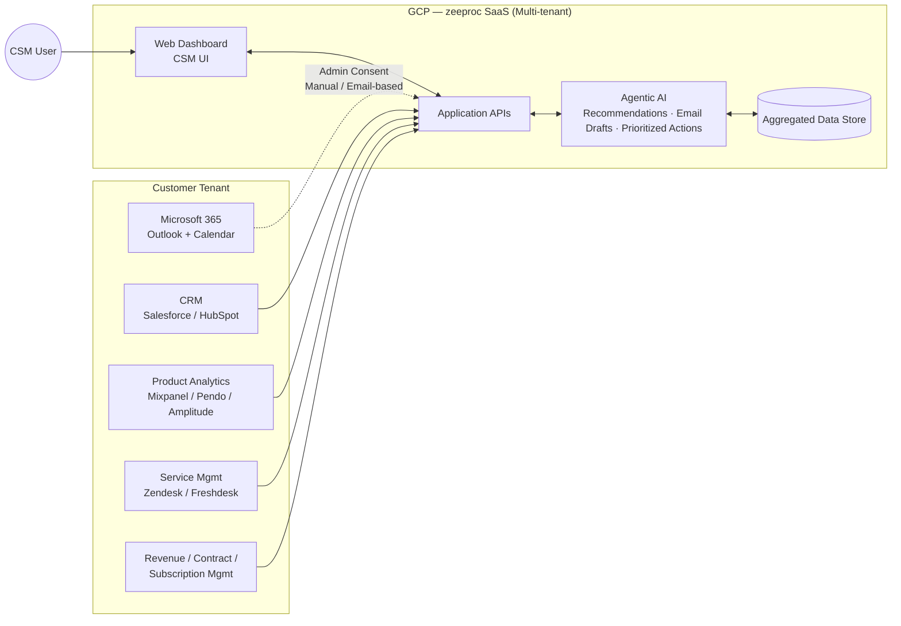
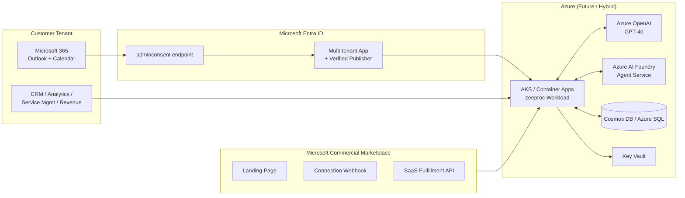
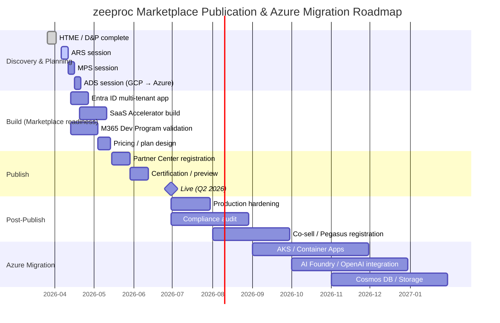

# AGENTWARE AI TECHNOLOGIES PRIVATE LIMITED — Scope Analysis Result

> **Source**: `1. Scope.md`  
> **Prompt**: `1. Scope_prompt.md`  
> **Engagement**: ME-124326 (ARS) · PRE-361041  
> **Solution**: zeeproc — Agentic AI Customer Success Platform

---

## 1. Partner Info

| Field | Value |
| --- | --- |
| **Account** | AGENTWARE AI TECHNOLOGIES PRIVATE LIMITED |
| **Solution Name** | zeeproc |
| **Country** | India |
| **Industry** | Agentic AI SaaS — B2B Customer Success Platform (Onboarding · Health Monitoring · Advocacy · Renewals · Expansion) |
| **Engagement Manager** | Douglas Tan Yan Hao (`v-tanyanhaod@microsoft.com`) |
| **Technical Account Lead** | — |
| **Primary Contact** | Mr Kumar Rajendran (`kumar@zeeproc.com`, +91-9632273344) |
| **Secondary Contact** | Aryan Singla (`aryan@zeeproc.com`) |
| **Current Marketplace Status** | Legal Verification: **Authorized**. New Build & Publish Engagement (Outreach 1). Offer not yet published. |
| **Current Hosting** | Google Cloud Platform (GCP) — multi-tenant SaaS, custom containerized workload |
| **Future Plan** | Review Azure migration within 9–12 months. Publish a Transactable SaaS Offer (Get it now) to Microsoft Commercial Marketplace in **Q2 2026** |
| **Target Customers** | SMB to mid-market B2B organizations with Customer Success teams |
| **Engagement Stage** | D&P in progress (HTFollowingSessions — Syafiqah, completed on 26/03). **ARS session requested for 06/04 – 10/04** |

### Current Architecture Overview (As-Is)

---

## 2. Situation — Problem

The following breaks down the partner's core problems.

### 2.1 Friction in Microsoft Entra ID admin consent flow
- **Root cause**: During Outlook/Calendar integration, the multi-tenant application is not formally registered in Microsoft Entra ID, so customer tenant administrators rely on **manual email-based approval**.
- **Impact**: Increased friction during customer onboarding → higher drop-off rate and delayed enterprise adoption. There is no standard admin consent experience that can grant multiple mailbox/calendar permissions at once.

### 2.2 Microsoft 365 Developer Program / Toolkit access not secured
- **Root cause**: There is no isolated tenant environment available to validate and test the Entra ID integration flow. The Developer Program enrollment is still in progress and currently **blocked**.
- **Impact**: End-to-end testing of the integration and admin consent flow cannot proceed. This affects the marketplace publication schedule.

### 2.3 Marketplace fit not yet verified for the current GCP-hosted state
- **Root cause**: The solution is hosted on GCP, and alignment with Marketplace publication policies, especially the *Azure value-add* requirement and Transactable SaaS Offer prerequisites, has not yet been validated.
- **Impact**: Uncertainty about publishability → architecture and AI usage must be reviewed first through ARS.

### 2.4 Lack of Microsoft alignment in the agentic AI architecture
- **Root cause**: The AI agent layer (data analysis, recommendation generation, email drafting, prioritized action surfacing) is implemented with an internal model/stack, but the integration points with **Azure AI Foundry / Azure OpenAI / Microsoft 365 Copilot ecosystem** are not clearly defined.
- **Impact**: Limited ability to use ISV AI program benefits (AI Sprint, Pegasus, Azure credits). Weaker Microsoft co-sell motion.

### 2.5 Transactable SaaS Offer technical requirements are not ready
- **Root cause**: Core technical assets for a Transactable Offer, such as Landing Page URL, Connection Webhook, SaaS Fulfillment API, and Entra ID Tenant ID/Application ID, have not yet been built or validated.
- **Impact**: Delay in passing Technical Configuration during Partner Center registration. Risk to the **Q2 2026 publication target**.

### 2.6 No GCP-to-Azure migration roadmap yet
- **Root cause**: Although migration is planned within 9–12 months, there is no step-by-step service mapping or execution plan by Compute/Storage/Networking/AI/Container.
- **Impact**: A migration blueprint must be established through ADS. There is no long-term Azure consumption conversion strategy after publication.

### Problem Summary

| # | Problem | Severity | Engagement |
| --- | --- | --- | --- |
| 2.1 | Entra ID admin consent friction | High | ARS |
| 2.2 | Microsoft 365 Developer Program not secured | High | EM Action |
| 2.3 | GCP-hosted Marketplace fit not validated | Medium | ARS / MPS |
| 2.4 | Lack of Microsoft alignment for agentic AI | Medium | ARS |
| 2.5 | Transactable SaaS technical assets not ready | High | MPS |
| 2.6 | No GCP-to-Azure migration roadmap | Medium | ADS |

---

## 3. Task — Suggestion

The following are actionable, Microsoft-aligned recommendations for each issue.

### 3.1 Standardize the Entra ID multi-tenant app registration
- **Action**: Register the zeeproc application in Microsoft Entra ID as a **multi-tenant application**. Define the required Microsoft Graph permissions (`Mail.Read`, `Mail.Send`, `Calendars.ReadWrite`, etc.). Use the **admin consent endpoint** (`/adminconsent`) or an admin consent URL so tenant administrators can grant permissions from a single screen. If possible, complete **Verified Publisher** registration as well.
- **Why**: This is the Microsoft-recommended authentication pattern for multi-tenant SaaS. It removes onboarding friction and supports enterprise IT policy compliance. Verified Publisher improves trust on the consent screen and can increase conversion.

### 3.2 Secure Microsoft 365 Developer Program access
- **Action**: Work with the Engagement Manager (Douglas) to accelerate enrollment in the Microsoft 365 Developer Program. Use a **Developer Tenant + 25 licenses + Sample Data Pack** to validate the Outlook/Calendar integration flow and admin consent in an isolated environment.
- **Why**: This enables safe validation of the admin consent flow, Graph API integration, and permission changes without affecting production tenants. It is a required validation environment before marketplace publication.

### 3.3 Proceed with Transactable SaaS Offer publication even while hosted on GCP
- **Action**: Use the fact that a SaaS Offer can be published regardless of hosting location to set **ARS pass** as the immediate goal. During ARS, prepare and submit (a) AI usage details, (b) data flow, (c) Microsoft 365 integration boundaries, and (d) Marketplace policy compliance items.
- **Why**: GCP hosting is not a hard blocker for publication, so the Q2 2026 target can be maintained while Azure migration is pursued in parallel. Once ARS is passed, the path to MPS is straightforward.

### 3.4 Identify Microsoft-native AI service touchpoints incrementally
- **Action**:
  - Insight / recommendation summaries → **Azure OpenAI Service** (GPT-4o / GPT-4o-mini)
  - Agent orchestration → **Azure AI Foundry Agent Service** / Semantic Kernel
  - Model operations (evaluation and monitoring) → **Azure AI Foundry** (Evaluations, Tracing)
  - Microsoft 365 / Copilot ecosystem expansion → **Microsoft 365 Agents Toolkit** / Copilot Studio review
- **Why**: Adopting even one Azure-native AI component can establish eligibility for ISV AI program benefits (credits, AI Sprint, Pegasus). It satisfies the ARS *Azure value-add* expectation and strengthens the co-sell motion.

### 3.5 Build the Transactable SaaS Offer technical assets using the SaaS Accelerator
- **Action**: Reduce implementation effort by adopting the **Microsoft Commercial Marketplace SaaS Accelerator** (C# / ASP.NET MVC). Use it to obtain the Landing Page, Subscription Webhook, Admin Portal, and SaaS API Emulator in one package. For pricing, start with **Per User (CSM seat-based) Flat Rate** and design expansion options using **Custom Meter Dimensions** (e.g., processed emails / accounts).
- **Why**: The SaaS Accelerator shortens marketplace readiness from *days* to *hours*. A per-user model aligns with the solution's business value. A **1-month free trial** option can further improve self-service onboarding.

### 3.6 Define the GCP-to-Azure migration roadmap (ADS)
- **Action**: In the ADS session, create a layer-by-layer 1:1 mapping table and adopt **Azure Migrate + Azure Landing Zones (Enterprise-Scale)**.

| Layer | GCP (As-Is) | Azure (To-Be) |
| --- | --- | --- |
| Compute (Container) | GKE / GCE | **AKS** / Azure Container Apps |
| Storage (Object) | Cloud Storage | **Azure Blob Storage** |
| Database | Cloud SQL / Firestore | **Azure SQL Database** / **Cosmos DB** |
| Identity | (Internal) | **Microsoft Entra ID** (already being aligned) |
| AI / LLM | Internal container model | **Azure AI Foundry** + **Azure OpenAI** |
| Networking | VPC | VNet + Private Endpoint + Front Door |
| Secrets | Secret Manager | **Azure Key Vault** + Managed Identity |

- **Why**: After publication, this enables phased Azure consumption growth and supports a Private Offer strategy for **MACC**-eligible customers. It also preserves eligibility for the ISV Success Program.

### Recommended To-Be Architecture (Conceptual)

---

## 4. Action — Resources & Best Practices

| # | Item | Details | URL |
| --- | --- | --- | --- |
| 1 | Multi-tenant App + Admin Consent | Standard pattern for tenant administrators to grant consent at once | https://learn.microsoft.com/en-us/entra/identity/enterprise-apps/grant-admin-consent |
| 2 | Multi-tenant SaaS authentication pattern | Guide for registering a multi-tenant Entra ID app | https://learn.microsoft.com/en-us/entra/identity-platform/howto-convert-app-to-be-multi-tenant |
| 3 | Verified Publisher program | Improves trust on the consent screen | https://learn.microsoft.com/en-us/entra/identity-platform/publisher-verification-overview |
| 4 | Microsoft Graph Mail/Calendar Permissions | Defines required permission scopes | https://learn.microsoft.com/en-us/graph/permissions-reference |
| 5 | Microsoft 365 Developer Program | Free tenant for development and validation | https://developer.microsoft.com/en-us/microsoft-365/dev-program |
| 6 | SaaS offer publication guide | Plan a SaaS offer for Microsoft Marketplace | https://learn.microsoft.com/en-us/partner-center/marketplace-offers/plan-saas-offer |
| 7 | Transactable SaaS — Landing Page build | Required technical requirements | https://learn.microsoft.com/en-us/partner-center/marketplace-offers/azure-ad-saas |
| 8 | SaaS Connection Webhook | Endpoint for asynchronous event handling | https://learn.microsoft.com/en-us/partner-center/marketplace-offers/pc-saas-fulfillment-webhook |
| 9 | SaaS Fulfillment APIs | Manages the subscription lifecycle | https://learn.microsoft.com/en-us/partner-center/marketplace-offers/pc-saas-fulfillment-api-v2 |
| 10 | SaaS Accelerator (reference implementation) | Landing Page + Webhook + Admin Portal | https://github.com/Azure/Commercial-Marketplace-SaaS-Accelerator |
| 11 | SaaS API Emulator | Local Marketplace API testing | https://github.com/microsoft/Commercial-Marketplace-SaaS-API-Emulator |
| 12 | Mastering the Marketplace (SaaS) | Official learning material | https://microsoft.github.io/Mastering-the-Marketplace/saas/ |
| 13 | Marketplace Certification policy | Validation items before publishing | https://learn.microsoft.com/en-us/legal/marketplace/certification-policies |
| 14 | Azure OpenAI Service | GPT-4o-based insight and email drafting | https://learn.microsoft.com/en-us/azure/ai-services/openai/overview |
| 15 | Azure AI Foundry — Agent Service | Agentic AI operating platform | https://learn.microsoft.com/en-us/azure/ai-foundry/agents/overview |
| 16 | Microsoft 365 Agents Toolkit | Integration with the M365 / Copilot ecosystem | https://learn.microsoft.com/en-us/microsoft-365/agents-sdk/ |
| 17 | ISV Success Program | AI credits / Pegasus benefits | https://www.microsoft.com/en-us/isv/program-benefits |
| 18 | GCP to Azure service mapping | 1:1 mapping reference | https://learn.microsoft.com/en-us/azure/architecture/gcp-professional/services |
| 19 | Azure Landing Zones | Enterprise-scale architecture baseline | https://learn.microsoft.com/en-us/azure/cloud-adoption-framework/ready/landing-zone/ |
| 20 | Private Offers | Enterprise negotiation pricing and bundling | https://learn.microsoft.com/en-us/partner-center/marketplace-offers/private-offers |

---

## 5. Result (Assuming Partner Implements Recommendations)

| Recommendation | Expected Outcome |
| --- | --- |
| **3.1** Entra ID multi-tenant app + admin consent | Reduced onboarding friction through admin consent → higher enterprise adoption. Verified Publisher further increases trust on the consent screen |
| **3.2** Secure Microsoft 365 Developer Program access | End-to-end Outlook/Calendar integration validation becomes possible → lowers risk to the Q2 2026 publication schedule |
| **3.3** Proceed while hosted on GCP | Higher likelihood of passing the first ARS review → keeps the publication schedule on track while Azure migration continues in parallel |
| **3.4** Incremental Azure-native AI integration | Eligibility for ISV AI program benefits, stronger co-sell motion, and initial Azure consumption signals |
| **3.5** Adopt SaaS Accelerator | Shorter time to build Landing Page / Webhook → faster Partner Center Technical Configuration completion |
| **3.6** ADS-based migration roadmap | Clear Azure transition blueprint within 9–12 months → enables a Private Offer strategy for MACC customers |

### Agenda for Next Meeting (ARS — 06/04 ~ 10/04)

| # | Agenda Item | Owner | Duration |
| --- | --- | --- | --- |
| 1 | Solution architecture walkthrough (multi-tenant SaaS · AI agent flow · data flow) | Partner | 20 min |
| 2 | Microsoft 365 / Entra ID integration review (app registration · Graph permissions · admin consent) | Microsoft | 20 min |
| 3 | AI usage validation (map current model stack to Azure OpenAI / AI Foundry options) | Joint | 15 min |
| 4 | Marketplace policy alignment review (SaaS offer policy · supplemental content) | Microsoft | 15 min |
| 5 | Follow-up on Microsoft 365 Developer Program enrollment | Douglas (EM) | 5 min |
| 6 | Production readiness checklist (security · monitoring · SLA · data isolation · India DPDP) | Joint | 15 min |
| 7 | Define action items and preparation for MPS / ADS sessions | Joint | 10 min |

---

## 6. Next Steps (Post-Validation Plan)

The roadmap below assumes ARS / MPS / ADS validation is completed successfully.

### 6.1 Production Hardening (Q2 2026)
- Multi-tenant data isolation (tenant boundaries, encryption at rest / in transit)
- Managed Identity / Key Vault-based secret management
- 24/7 webhook availability (retry / monitoring / alerting)

### 6.2 Performance Benchmarking
- Measure agentic AI workflow latency (recommendation generation, email drafting)
- Model Azure OpenAI throughput and token cost
- Load test concurrent tenant scenarios (based on CSM seat count)

### 6.3 Security & Compliance Audit
- Verify compliance with Marketplace Certification policies
- Review readiness for the **India DPDP Act**, **GDPR** (for EU customers), and **SOC 2 Type II**
- Revalidate Microsoft Graph least-privilege permissions

### 6.4 Marketplace Optimization
- Listing SEO (keywords: Customer Success, Agentic AI, B2B SaaS, CSM)
- Upload screenshots, demo videos, and case studies
- Run customer review campaigns and register as co-sell ready
- Earn Solution Assessment and Marketplace badges

### 6.5 Customer Migration & Go-to-Market
- Offer a phased migration path for existing GCP customers to Azure instances
- Secure the first reference customer (India-based SMB to mid-market)
- Register for Microsoft co-sell → enter ISV Success / Pegasus / AI Sprint
- Expand enterprise deal size with a Private Offer strategy for MACC-eligible customers

### 6.6 Continuous Improvement
- Establish Azure AI Foundry-based model lifecycle (Train → Evaluate → Deploy → Monitor)
- Add plans and adjust Custom Meter Dimensions based on customer telemetry (processed emails / accounts)
- Expand distribution surface through Microsoft 365 Agents Toolkit / Copilot Studio integration

### Roadmap Timeline

---

> This document is an automatically generated analysis result based on the input from `1. Scope.md`, following the 6-step framework in `1. Scope_prompt.md` (Partner Info → Situation → Task → Action → Result → Next Steps). **Please confirm with the partner and update after the ARS session (06/04 – 10/04).**