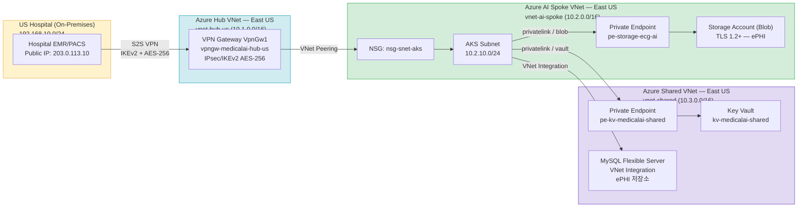

# HIPAA 네트워크 구현 가이드 — MedicalAI AiTiA ECO CENTER (최소 비용)

> **적용 규정**: §164.312(e)(1) 전송 보안, §164.312(e)(2)(ii) 전송 중 암호화, §164.312(b) 감사 통제
> **구현 방식**: Azure Portal GUI 기준
> **프로젝트 도메인**: `medicalai.onmicrosoft.com`
> **버전**: v4 (2026-04-20 — 최소 HIPAA 요구사항 / 비용 최적화)

> **비용 전략**: Azure Firewall Premium 제거 → NSG + VPN IPsec으로 전송 보안 충족. VPN Gateway 다운그레이드. Log 장기 보존을 Storage Archive로 대체.

---

## 월 비용 추정 (East US)

| 리소스 | SKU | 월 추정 |
|---|---|---|
| VPN Gateway | VpnGw1 (단일 Active) | ~$142 |
| S2S 터널 | 1개 | ~$10 |
| NSG | 무료 | $0 |
| Private Endpoint (Storage) | 1개 | ~$7 |
| Private Endpoint (Key Vault) | 1개 | ~$7 |
| MySQL Flexible Server | Burstable B2s | ~$37 |
| Storage Account (Blob, 1TB) | LRS | ~$18 |
| Key Vault | Standard | ~$1 |
| Log Analytics (30일 보존) | ~3GB/일 | ~$207 |
| Storage Archive (6년 보존용) | ~300GB/월 적재 | ~$1 |
| Public IP ×2 | Standard | ~$7 |
| **합계** | | **~$437/월** (~59만원) |

> ver3 대비 약 **$2,663 절감 (~86% 감소)**. Firewall Premium 제거가 최대 절감 요인.

---

## 아키텍처 다이어그램

---

## 1. Azure VPN Gateway

**HIPAA 관련 조항**: §164.312(e)(1) 전송 보안, §164.312(e)(2)(ii) 전송 중 암호화

---

### 1-1. VPN Gateway 생성

> Azure Portal → Virtual Network Gateways → + Create

| 소분류 | 항목 | 예시 값 |
|---|---|---|
| 기본 정보 | Name | `vpngw-medicalai-hub-us` |
| | Region | East US |
| | Gateway type | VPN |
| | VPN type | Route-based |
| SKU 선택 | Gateway SKU | `VpnGw1` *(비용 최적화)* |
| | Generation | Generation1 |
| | Zone redundancy | **없음** *(비용 절감)* |
| VNet 연결 | Virtual network | `vnet-hub-us` |
| | Subnet | GatewaySubnet (`10.1.255.0/27`) |
| 공인 IP | Public IP name | `pip-vpngw-medicalai-hub-us` |
| | SKU | Standard |
| Active-Active | Enable active-active mode | **끔** *(비용 절감)* |
| BGP | Configure BGP | **켬** |
| | ASN | `65515` |

> ⚠️ Active-Active 미사용 시 gateway 장애 시 수 분간 다운타임 가능. 가용성 SLA 요건 확인 필요.

완료 후 **Review + create** → **Create** 클릭

---

### 1-2. Local Network Gateway (미국 병원 온프레미스 정보 등록)

> Azure Portal → Local Network Gateways → + Create

| 소분류 | 항목 | 예시 값 |
|---|---|---|
| 기본 정보 | Name | `lng-hospital-us-onprem` |
| | Region | East US |
| 온프레미스 정보 | IP address | `203.0.113.10` (US Hospital 공인 IP) |
| | Address space | `192.168.10.0/24` |
| BGP 설정 | Configure BGP settings | **켬** |
| | ASN | `65001` |
| | BGP peer IP address | `192.168.10.1` |

---

### 1-3. VPN Connection 생성 (IPsec/IKEv2 + AES-256)

> Azure Portal → Virtual Network Gateways → `vpngw-medicalai-hub-us` → Connections → + Add

| 소분류 | 항목 | 예시 값 |
|---|---|---|
| 기본 정보 | Name | `conn-hospital-us-s2s` |
| | Connection type | Site-to-site (IPsec) |
| 연결 대상 | Local network gateway | `lng-hospital-us-onprem` |
| 인증 | Shared key (PSK) | *(Key Vault secret `vpn-psk-hospital-us` 값 사용)* |
| BGP | Enable BGP | **켬** |

**Custom IPsec Policy 적용 (HIPAA 요구 AES-256)**

> `conn-hospital-us-s2s` → Configuration → Use custom IPsec/IKE policy: **켬**

| 소분류 | 항목 | 예시 값 |
|---|---|---|
| IKE Phase 1 | IKE encryption | `AES256` |
| | IKE integrity | `SHA256` |
| | DH Group | `DHGroup14` |
| IKE Phase 2 | IPsec encryption | `GCMAES256` |
| | IPsec integrity | `GCMAES256` |
| | PFS Group | `PFS2048` |
| | SA Lifetime (seconds) | `28800` |

> HIPAA 포인트: §164.312(e)(2)(ii) — AES-256으로 전송 중 ePHI 암호화
>
> **PSK 관리 정책**: Key Vault secret으로 관리. 교체 주기 연 1회 (또는 인원 변경 시 즉시).

---

### 1-4. VPN Diagnostics 활성화

> `vpngw-medicalai-hub-us` → Diagnostic settings → + Add diagnostic setting

| 소분류 | 항목 | 예시 값 |
|---|---|---|
| 설정 이름 | Diagnostic setting name | `diag-vpngw-hipaa` |
| 로그 카테고리 | GatewayDiagnosticLog | ✅ |
| | TunnelDiagnosticLog | ✅ |
| | IKEDiagnosticLog | ✅ |
| 단기 보존 (감사) | Send to Log Analytics workspace | `law-medicalai-shared` (30일) |
| 장기 보존 (HIPAA 6년) | Archive to Storage Account | `stmedicalaiarchive` |
| 보존 기간 | Storage Archive retention | `2190일` *(6년, §164.312(b))* |

---

## 2. NSG — 네트워크 접근 통제

**HIPAA 관련 조항**: §164.312(e)(1) 전송 보안

> Azure Firewall Premium 대신 NSG로 최소 권한 접근 통제 구현. HIPAA는 특정 방화벽 제품을 요구하지 않음 — VPN 암호화 + NSG 조합으로 §164.312(e)(1) 충족 가능.

---

### 2-1. AKS Subnet NSG

> Azure Portal → Network security groups → + Create → `nsg-snet-aks`

| 소분류 | 항목 | 예시 값 |
|---|---|---|
| Inbound Rule 1 | Name | `allow-vpngw-to-aks-443` |
| | Source | VPN Gateway Subnet (`10.1.255.0/27`) |
| | Destination | AKS Subnet (`10.2.10.0/24`) |
| | Port | `443` |
| | Action | Allow |
| Inbound Rule 2 | Name | `allow-vnet-internal` |
| | Source | VirtualNetwork |
| | Destination | AKS Subnet |
| | Port | `443, 3306` *(MySQL)* |
| | Action | Allow |
| Inbound Deny All | Name | `deny-all-inbound` |
| | Priority | `4096` |
| | Action | Deny |

> Subnet 연결: `vnet-ai-spoke` → `snet-aks` → Network security group → `nsg-snet-aks`

---

### 2-2. NSG Diagnostics

> `nsg-snet-aks` → Diagnostic settings → + Add

| 소분류 | 항목 | 예시 값 |
|---|---|---|
| 로그 | NetworkSecurityGroupEvent | ✅ |
| | NetworkSecurityGroupRuleCounter | ✅ |
| 단기 보존 | Log Analytics workspace | `law-medicalai-shared` (30일) |
| 장기 보존 | Archive to Storage Account | `stmedicalaiarchive` (2190일) |

---

## 3. Private Endpoint

**HIPAA 관련 조항**: §164.312(e)(1) 전송 보안 — 공용 인터넷 경유 차단

---

### 3-1. Storage Account Private Endpoint

> Storage account → Networking → Private endpoint connections → + Private endpoint

| 소분류 | 항목 | 예시 값 |
|---|---|---|
| 기본 정보 | Name | `pe-storage-ecg-ai` |
| | Region | East US |
| Resource | Target sub-resource | `blob` |
| 네트워크 | Virtual network | `vnet-ai-spoke` |
| | Subnet | `snet-private-endpoints` (`10.2.20.0/27`) |
| DNS | Private DNS zone | `privatelink.blob.core.windows.net` |
| TLS | Minimum TLS version | `TLS1_2` |
| | Secure transfer required | ✅ |

---

### 3-2. Key Vault Private Endpoint

> Key Vault → Networking → Private endpoint connections → + Private endpoint

| 소분류 | 항목 | 예시 값 |
|---|---|---|
| 기본 정보 | Name | `pe-kv-medicalai-shared` |
| | Region | East US |
| Resource | Target sub-resource | `vault` |
| 네트워크 | Virtual network | `vnet-shared` |
| | Subnet | `snet-private-endpoints` (`10.3.20.0/27`) |
| DNS | Private DNS zone | `privatelink.vaultcore.azure.net` |
| 공용 접근 | Allow public access | **Off** |

---

### 3-3. MySQL Flexible Server (VNet Integration)

> MySQL Flexible Server → Networking → Private access (VNet Integration)

| 소분류 | 항목 | 예시 값 |
|---|---|---|
| 접속 방식 | Connectivity method | **Private access (VNet Integration)** |
| 네트워크 | Virtual network | `vnet-shared` |
| | Delegated subnet | `snet-mysql-delegated` (`10.3.10.0/28`) |
| 공용 접근 | Disable public access | ✅ |
| TLS | Require SSL | **ON** (`REQUIRE_SECURE_TRANSPORT = ON`) |

> HIPAA 포인트: VNet Integration으로 인터넷 노출 없음. Private Endpoint 불필요 — 비용 절감.

---

## 4. Log Analytics + Storage Archive (HIPAA 6년 보존)

**HIPAA 관련 조항**: §164.312(b) 감사 통제

> **비용 전략**: Log Analytics는 30일 보존(운영 조회용). 30일 초과분은 Storage Account Cool/Archive 티어로 자동 이관 → 6년 보존 비용 최소화.

---

### 4-1. Log Analytics Workspace

> Azure Portal → Log Analytics workspaces → + Create

| 소분류 | 항목 | 예시 값 |
|---|---|---|
| 기본 정보 | Name | `law-medicalai-shared` |
| | Region | East US |
| 보존 기간 | Retention | `30일` *(비용 절감 — 운영 조회용)* |

---

### 4-2. Storage Account (장기 보존 아카이브)

> Azure Portal → Storage accounts → + Create → `stmedicalaiarchive`

| 소분류 | 항목 | 예시 값 |
|---|---|---|
| 기본 정보 | Name | `stmedicalaiarchive` |
| | Region | East US |
| | Redundancy | LRS *(비용 절감)* |
| Access tier | Default | Cool |
| TLS | Minimum TLS version | `TLS1_2` |
| 공용 접근 | Allow Blob public access | **Off** |

**Lifecycle Management 정책 설정**

> `stmedicalaiarchive` → Data management → Lifecycle management → + Add rule

| 소분류 | 항목 | 예시 값 |
|---|---|---|
| Rule | 30일 이후 → Archive tier 이동 | 자동 이관 |
| 삭제 | 2191일(6년+1일) 이후 삭제 | HIPAA 보존 만료 후 자동 폐기 |

> HIPAA 포인트: §164.312(b) — 6년 감사 로그 보존. Storage Archive 단가 ~$0.001/GB/월로 Log Analytics 대비 약 99% 비용 절감.

---

## 요약 — HIPAA 조항별 구현 매핑

| HIPAA 조항 | 내용 | 구현 서비스 |
|---|---|---|
| §164.312(e)(1) | 전송 보안 | VPN Gateway (IPsec), NSG, Private Endpoint |
| §164.312(e)(2)(ii) | 전송 중 암호화 | IPsec AES-256, TLS 1.2 강제 (Storage, Key Vault, MySQL SSL) |
| §164.312(b) | 감사 통제 | Log Analytics (30일) + Storage Archive (6년) |

---

## ver3 대비 변경 사항

| 항목 | ver3 | ver4 (최소 비용) |
|---|---|---|
| VPN Gateway SKU | VpnGw2AZ (Zone-redundant) | VpnGw1 (단일) |
| Active-Active | 켬 | 끔 |
| Azure Firewall Premium | ✅ ($1,603/월) | ❌ 제거 |
| 전송 보안 대체 | Firewall Premium + IDPS | NSG (최소 권한 규칙) |
| Log 장기 보존 | Log Analytics 2190일 | Storage Archive 2190일 |
| 월 비용 | ~$3,100 | **~$437** |
