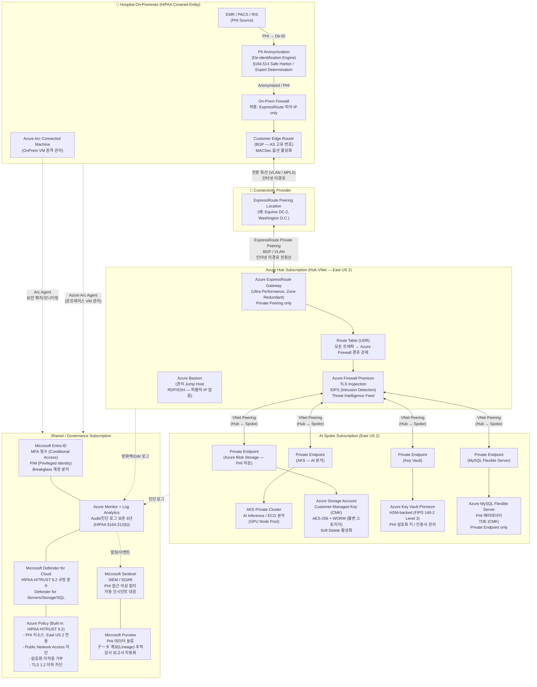

# 아키텍처: Hospital ↔ Azure (ExpressRoute 기반)

> **규정 준수 기준**: HIPAA (Health Insurance Portability and Accountability Act), HITECH, 45 CFR Part 164 (Security Rule)  
> **적용 대상**: 미국 내 의료기관 — PHI(Protected Health Information) 전송 및 저장 환경

---

## 개요

병원 온프레미스 네트워크와 Azure를 **전용 사설 회선(ExpressRoute)**으로 연결한다.  
인터넷을 경유하지 않으며, Layer 3 전용 연결로 **HIPAA PHI 전송 보안 요건을 가장 강력하게 충족**한다.  
높은 대역폭, 저지연, 예측 가능한 성능이 필요한 대형 병원 / 의료 데이터 센터에 권장한다.

---

## 아키텍처 다이어그램



---

## HIPAA 보안 규정 매핑

| HIPAA Security Rule | 구현 컨트롤 | Azure 서비스 |
|---|---|---|
| **§164.312(a)(1)** Access Control | RBAC + MFA + PIM + Conditional Access | Microsoft Entra ID, PIM |
| **§164.312(a)(2)(iv)** Encryption | CMK (HSM-backed), AES-256, TDE | Key Vault Premium (HSM) |
| **§164.312(b)** Audit Controls | 6년 감사 로그, PHI 접근 추적 | Log Analytics, Purview |
| **§164.312(c)(1)** Integrity | WORM 스토리지, Hash 검증, 변조 경보 | Immutable Storage, Defender |
| **§164.312(d)** Person Authentication | MFA 필수, Passwordless 지원 | Microsoft Entra ID |
| **§164.312(e)(1)** Transmission Security | 전용 사설 회선,인터넷 미경유 | ExpressRoute Private Peering |
| **§164.312(e)(2)(ii)** PHI Encryption in Transit | MACsec (L2), TLS 1.3 (L7) | ExpressRoute MACsec, AFW |
| **§164.514** De-identification | Safe Harbor / Expert Determination 적용 | 온프레미스 De-ID 엔진 |

---

## ExpressRoute 구성 세부 사항

### Peering 종류 선택

| Peering 유형 | 용도 | HIPAA 적합성 |
|---|---|---|
| **Private Peering** | 병원 ↔ Azure VNet (PHI 전송) | **필수 사용** — 전용 사설 연결 |
| Microsoft Peering | Microsoft 365, Dynamics (공용 서비스) | PHI 전송에 사용 금지 |

### MACsec (Layer 2 암호화)

ExpressRoute Direct를 사용하는 경우, MACsec을 활성화하여 Layer 2 수준 암호화를 추가한다:
- AES-128 / AES-256 지원
- Provider 네트워크에서의 패킷 도청 방지
- HIPAA §164.312(e)(2)(ii) 전송 암호화 추가 계층 충족

### 회로 이중화 (High Availability)

```
병원 Edge Router ─── 전용선 A ───┐
                                  ├── ExpressRoute Circuit ── Azure ER Gateway (Zone Redundant)
병원 Edge Router ─── 전용선 B ───┘
(Active-Active BGP, 자동 Failover)
```
- ExpressRoute SLA: **99.95%** (Zone Redundant Gateway 기준)
- 전용선 장애 시: 자동 Failover (BGP 수렴 시간 < 1분)

---

## 네트워크 보안 설계 원칙

### 1. 인터넷 완전 차단 (No Internet Path for PHI)
- ExpressRoute Private Peering: 인터넷 경유 없음
- PHI 서비스 리소스: `publicNetworkAccess = Disabled` 강제 (Azure Policy)
- 모든 서비스 엔드포인트: **Private Endpoint만 허용**

### 2. 강제 터널링 (Forced Tunneling)
- 온프레미스 발 트래픽: 모든 경로가 ExpressRoute를 통해 Azure 진입 후 Azure Firewall 검사
- UDR(User-Defined Route)로 0.0.0.0/0 → Azure Firewall 강제 라우팅
- Azure Firewall IDPS 모드: **Alert and Deny** (의료 데이터 환경)

### 3. PHI 데이터 암호화
- **전송 중(In-Transit)**: MACsec (L2) + TLS 1.3 (L7) 이중 암호화
- **저장 중(At-Rest)**: CMK (Customer-Managed Key) — Key Vault HSM(FIPS 140-2 Level 3)
- **키 관리**: 90일 자동 로테이션, 키 접근 이벤트 전수 감사

### 4. 데이터 거주지 (Data Residency)
- Azure Policy로 **East US 2 외 리전 리소스 배포 거부**
- Purview: PHI 데이터 분류 태그 자동 적용 및 계보 추적

### 5. 감사 및 인시던트 대응
- **Sentinel**: PHI 데이터 비정상 접근 패턴 자동 탐지 → 자동 격리(SOAR)
- **Log Analytics**: 보존 6년 (HIPAA), 변경 불가(Immutable) 설정
- **Purview 감사 보고서**: HIPAA 연간 감사 대비 자동 리포트 생성

---

## VPN Gateway 대비 ExpressRoute 비교

| 항목 | VPN Gateway | ExpressRoute |
|---|---|---|
| **네트워크 경로** | 인터넷 경유 (암호화 터널) | 전용 사설 회선 (인터넷 미경유) |
| **최대 대역폭** | 10 Gbps | 100 Gbps (ER Direct) |
| **지연 시간** | 변동 있음 (인터넷) | 안정적, 예측 가능 |
| **SLA** | 99.9% | 99.95% |
| **HIPAA PHI 전송** | 가능 (IPsec 암호화) | **권장** (인터넷 미경유) |
| **비용** | 저렴 | 고가 (전용선 비용) |
| **권장 대상** | 소형 병원, 낮은 데이터량 | 대형 병원, 높은 데이터량, 엄격한 보안 요건 |

---

## BAA (Business Associate Agreement)

Microsoft는 HIPAA BAA에 서명한다. Azure 서비스 이용 전 반드시 [Microsoft HIPAA BAA](https://www.microsoft.com/en-us/trust-center/privacy/hipaa-hitech) 체결 필요.  
ExpressRoute 제공 파트너(Equinix 등)와도 별도 BAA 또는 Data Processing Agreement 체결 권장.
