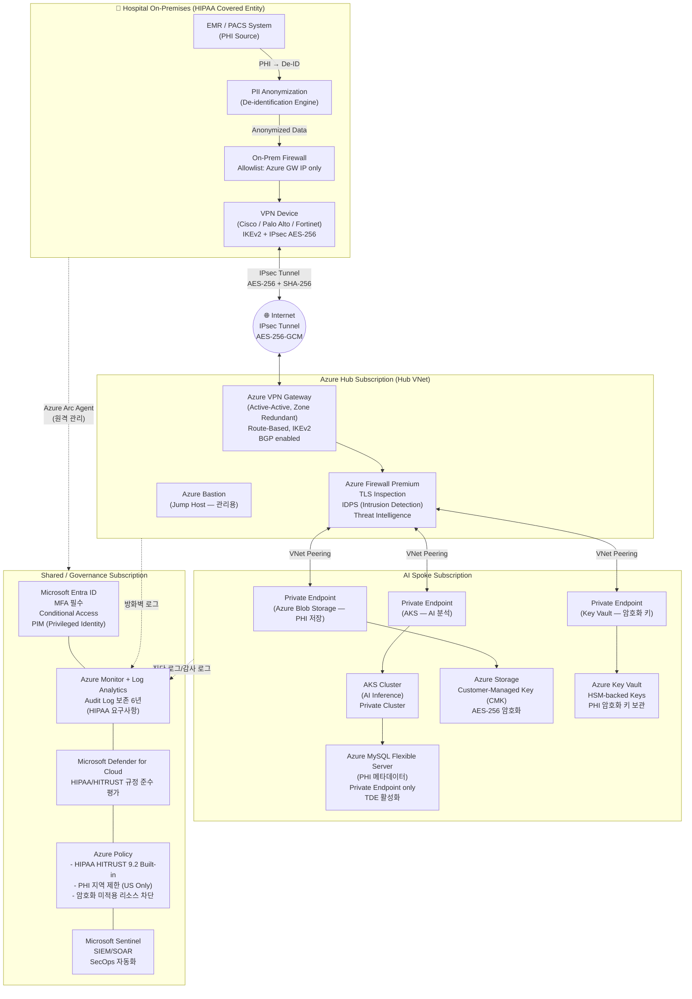

# 아키텍처: Hospital ↔ Azure (VPN Gateway 기반)

> **규정 준수 기준**: HIPAA (Health Insurance Portability and Accountability Act), HITECH, 45 CFR Part 164 (Security Rule)  
> **적용 대상**: 미국 내 의료기관 — PHI(Protected Health Information) 전송 및 저장 환경

---

## 개요

병원 온프레미스 네트워크와 Azure를 **IPsec/IKEv2 암호화 터널(VPN Gateway)**로 연결한다.  
인터넷을 경유하지만 End-to-End 암호화가 보장되며, 전용 회선 없이 구성 가능한 비용 효율적 옵션이다.

---

## 아키텍처 다이어그램

---

## HIPAA 보안 규정 매핑

| HIPAA Security Rule | 구현 컨트롤 | Azure 서비스 |
|---|---|---|
| **§164.312(a)(1)** Access Control | RBAC + MFA + PIM | Microsoft Entra ID, PIM |
| **§164.312(a)(2)(iv)** Encryption & Decryption | CMK, AES-256, TDE | Key Vault (HSM), Storage CMK |
| **§164.312(b)** Audit Controls | 6년 감사 로그 보존 | Log Analytics, Sentinel |
| **§164.312(c)(1)** Integrity | 데이터 변조 감지 | Defender for Storage, Hash 검증 |
| **§164.312(d)** Person Authentication | MFA, Conditional Access | Microsoft Entra ID |
| **§164.312(e)(1)** Transmission Security | IPsec AES-256, TLS 1.3 | VPN Gateway, Azure Firewall |
| **§164.312(e)(2)(ii)** Encryption of PHI in transit | End-to-End 암호화 | VPN Gateway IKEv2 |

---

## 네트워크 보안 설계 원칙

### 1. Zero Trust Network Access
- 모든 트래픽은 Azure Firewall Premium에서 검사 (TLS Inspection 포함)
- PHI 데이터 서비스는 **Private Endpoint만 허용** — 퍼블릭 인터넷 접근 없음
- NSG(Network Security Group): 최소 권한 원칙 적용, 불필요 포트 전면 차단

### 2. PHI 데이터 암호화
- **전송 중(In-Transit)**: IPsec AES-256-GCM (VPN 터널) + TLS 1.3 (애플리케이션 레이어)
- **저장 중(At-Rest)**: Customer-Managed Key (CMK) — Key Vault HSM 연동
- **키 로테이션**: 90일 주기 자동 로테이션, 키 접근 감사 로그 유지

### 3. 감사 및 모니터링 (HIPAA Audit Controls)
- 모든 리소스의 진단 로그 → Log Analytics (보존: **6년**)
- PHI 접근 이벤트 → Microsoft Sentinel 실시간 경보
- Defender for Cloud: HIPAA HITRUST 9.2 규정 준수 점수 지속 모니터링

### 4. 병원 측 요구사항
- VPN Device: IKEv2 지원, AES-256 / SHA-256 / DH Group 14 이상
- 온프레미스에서 Azure로 전송 전 **반드시 De-identification 수행**
- Azure Arc Agent 설치 → 온프레미스 VM 보안 패치 자동화

---

## BAA (Business Associate Agreement)

Microsoft는 HIPAA BAA에 서명한다. Azure 서비스 이용 전 반드시 [Microsoft HIPAA BAA](https://www.microsoft.com/en-us/trust-center/privacy/hipaa-hitech) 체결 필요.

---

## 한계 및 고려사항

| 항목 | 내용 |
|---|---|
| **가용성** | VPN Gateway: 99.9% SLA (Active-Active 구성 시) |
| **대역폭** | 최대 10 Gbps (VpnGw5AZ 기준), 공유 인터넷 경유로 지연 가능 |
| **비용** | ExpressRoute 대비 저렴, 초기 구성 용이 |
| **권장 사용** | 소규모 병원, 데이터 전송량 적음, 비용 우선 시 |
