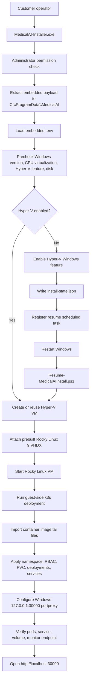
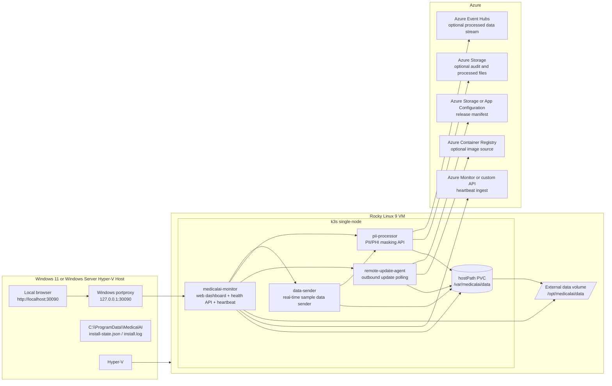
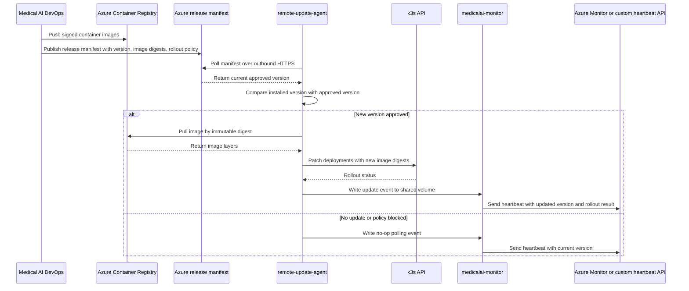

# Medical AI Installer

이 디렉터리는 `test_env` 프로젝트를 고객용 단일 설치 파일 형태의 `MedicalAI-Installer.exe`로 패키징하기 위한 빌드 영역이다.

설치 파일은 고객이 별도 값을 입력하지 않는 것을 전제로 한다. `.env`, Rocky Linux 9 VHDX, 컨테이너 이미지 tar, Kubernetes manifest, 설치 스크립트를 설치 파일 내부에 포함하고, 고객은 `MedicalAI-Installer.exe`를 관리자 권한으로 실행한다.

## 요구사항 판단

요구사항은 올바르다. 고객이 설치 시 값을 입력하지 않고, 사전에 작성된 `.env`를 설치 파일에 포함한 뒤 다음 흐름을 자동화하는 방식이 가장 자연스럽다.

```text
MedicalAI-Installer.exe 실행
→ 관리자 권한 확인
→ 내장 .env 읽기
→ Hyper-V 활성화
→ 필요 시 재부팅 후 자동 재개
→ Rocky Linux 9 VM 구성
→ k3s 및 Medical AI workload 배포
→ 모니터링 URL을 웹 브라우저로 자동 실행
```

## 설치 방식

추천 방식은 `Inno Setup + PowerShell bootstrapper`이다.

- Inno Setup: EXE 생성, 관리자 권한 요청, payload 압축 해제, 설치 시작
- PowerShell: Hyper-V, VM, 재부팅 재개, k3s 배포, monitor URL 실행 담당

## 1. 설치 과정 아키텍처

설치 과정은 Windows 호스트에서 시작하고, Hyper-V 활성화가 필요한 경우 재부팅 후 자동 재개한다. 설치가 완료되면 `medicalai-monitor` 웹 대시보드를 기본 브라우저로 연다.



설치 단계별 책임은 다음과 같다.

| 단계 | 담당 | 설명 |
|---|---|---|
| EXE 실행 | Inno Setup | 관리자 권한 요청, payload 압축 해제 |
| 환경 로드 | PowerShell | 내장 `.env` 읽기 |
| Hyper-V 처리 | PowerShell | 기능 활성화, 재부팅 필요 시 resume 등록 |
| VM 구성 | PowerShell + Hyper-V | Rocky Linux 9 VHDX 기반 VM 생성 |
| k3s 배포 | Linux guest script | k3s 확인, 이미지 import, manifest 적용 |
| 모니터링 접속 | PowerShell | `localhost:30090`으로 브라우저 실행 |

## 2. 설치 후 전체 아키텍처

설치 후에는 Windows 호스트가 Hyper-V와 브라우저 접속 지점 역할을 하고, Rocky Linux 9 VM 내부 k3s가 Medical AI 로컬 런타임을 실행한다. Azure 연결은 `.env`에 포함된 tenant, subscription, ACR, Storage, Event Hubs, update source 값을 사용한다.



설치 후 컨테이너 역할은 다음과 같다.

| 컨테이너 | 역할 | Azure 통신 |
|---|---|---|
| `data-sender` | 병원 데이터 발생 및 실시간 전송 흐름 모사 | 기본 없음. 필요 시 Azure 전송 전 단계로 확장 |
| `pii-processor` | PII/PHI 마스킹, 처리 결과 저장 | Event Hubs 또는 Storage로 전송 가능 |
| `remote-update-agent` | Azure release manifest polling, 업데이트 준비 | Azure Storage, App Configuration, ACR 조회 |
| `medicalai-monitor` | 웹 대시보드, health API, 볼륨/Pod/서비스 상태 확인 | Azure Monitor 또는 custom heartbeat endpoint로 상태 전송 |

모니터링 대시보드는 설치 종료 후 자동으로 열린다.

```text
http://localhost:30090
```

대시보드에서 확인할 항목은 다음과 같다.

- k3s node Ready 상태
- 4개 컨테이너 Running 상태
- `data-sender` 최근 전송 시간
- `pii-processor` 최근 마스킹 처리 시간
- `remote-update-agent` 최근 update polling 결과
- `/opt/medicalai/data` 사용량
- Azure heartbeat 성공/실패 상태

## 3. Azure 기반 업데이트 방식

업데이트는 고객 환경으로 inbound 접속을 열지 않고, `remote-update-agent`가 Azure의 release manifest를 주기적으로 조회하는 outbound 방식으로 구성한다. 새 버전이 있으면 ACR에서 이미지를 가져오거나 설치 파일에 포함된 offline image tar를 사용해 k3s workload를 갱신한다.



업데이트 방식의 핵심 원칙은 다음과 같다.

- 고객 병원망으로 외부 inbound 포트를 열지 않는다.
- `remote-update-agent`가 outbound HTTPS로 Azure release manifest를 polling한다.
- 업데이트 대상 이미지는 ACR에서 digest 기준으로 가져온다.
- `.env`에는 Azure tenant, subscription, ACR, release manifest URL, heartbeat endpoint가 사전 포함된다.
- `medicalai-monitor`는 업데이트 결과를 웹 UI와 heartbeat로 표시한다.
- 업데이트 실패 시 현재 정상 버전을 유지하고 실패 이벤트를 `/opt/medicalai/data/remote-update-agent`와 monitor dashboard에 남긴다.

업데이트에 필요한 Azure 정보는 다음과 같다.

| 항목 | 용도 |
|---|---|
| `AZURE_TENANT_ID` | Azure 인증 tenant |
| `AZURE_SUBSCRIPTION_ID` | 대상 subscription 식별 |
| `AZURE_CLIENT_ID` / `AZURE_CLIENT_SECRET` | ACR, Storage, release manifest 접근 인증 |
| `ACR_LOGIN_SERVER` | 컨테이너 이미지 source |
| `UPDATE_SOURCE_URL` | release manifest 조회 URL |
| `AZURE_STORAGE_ACCOUNT` / `AZURE_STORAGE_CONTAINER` | audit, release manifest, processed artifact 저장 |
| `AZURE_EVENTHUB_NAMESPACE` / `AZURE_EVENTHUB_NAME` | 처리 데이터 스트리밍 연동 |

초기 test_env에서는 `UPDATE_APPLY_ENABLED=false`로 두고 dry-run polling만 수행한다. 고객 운영 배포 단계에서는 서명 검증, digest pinning, rollback 정책, 업데이트 승인 정책을 추가해야 한다.

## 디렉터리 구조

```text
installer/
├── Build-Installer.ps1
├── MedicalAIInstaller.iss
├── README.md
├── assets/
│   ├── images/
│   └── rocky9/
├── output/
└── payload/
    ├── Install-MedicalAI.ps1
    ├── Open-Monitor.ps1
    ├── Resume-MedicalAIInstall.ps1
    └── README.md
```

## 대형 payload 준비

진짜 원클릭 설치 파일로 만들려면 아래 파일이 필요하다.

| 위치 | 필요 여부 | 설명 |
|---|---|---|
| `assets/rocky9/medicalai-rocky9-k3s.vhdx` | 필수 | Rocky Linux 9 + k3s 사전 구성 VM 이미지 |
| `assets/iso/Rocky-9.7-x86_64-minimal.iso` | 준비용 | VHDX 생성에 사용한 Rocky 9.7 minimal ISO |
| `assets/k3s/k3s` / `assets/k3s/install.sh` | 준비용 | k3s 설치 binary와 installer script |
| `assets/rpms/*.rpm` | 준비용 | 준비 환경에서 수집한 RPM dependency |
| `assets/versions.env` | 준비용 | 패키지에 포함된 주요 고정 버전 manifest |
| `assets/logs/rpm-asset-files.txt` | 준비용 | 다운로드된 RPM dependency 파일명 목록 |
| `assets/logs/python-base-image-digest.txt` | 준비용 | 빌드에 사용한 Python base image digest |
| `assets/images/data-sender.tar` | 권장 | 오프라인 배포용 컨테이너 이미지 |
| `assets/images/pii-processor.tar` | 권장 | 오프라인 배포용 컨테이너 이미지 |
| `assets/images/remote-update-agent.tar` | 권장 | 오프라인 배포용 컨테이너 이미지 |
| `assets/images/medicalai-monitor.tar` | 권장 | 웹 모니터링 컨테이너 이미지 |

현재 `test_env`에는 3개 앱만 구현되어 있다. 설치 종료 후 웹 브라우저 대시보드까지 완성하려면 `medicalai-monitor` 컨테이너를 추가 구현해야 한다.

## 빌드 방법

1. Inno Setup 6를 설치한다.
2. Windows 준비 환경에서 `scripts/windows/Prepare-InstallerAssets.ps1`로 현재 OS 프로파일을 감지하고 Rocky minimal ISO와 asset 디렉터리를 준비한다.
3. Rocky VM 내부에서 `scripts/linux/prepare-online-assets.sh`를 실행해 k3s, RPM, image tar, 배포 로그를 `installer/assets` 아래에 저장한다.
4. 준비된 VHDX를 `assets/rocky9/medicalai-rocky9-k3s.vhdx`에 넣는다.
5. 관리자 권한이 아닌 일반 PowerShell에서 아래를 실행한다.

```powershell
Set-ExecutionPolicy -Scope Process -ExecutionPolicy Bypass
.\Build-Installer.ps1
```

빌드 결과는 다음 위치에 생성된다.

```text
installer/output/MedicalAI-Installer.exe
```

감지된 OS 프로파일은 다음 파일에 저장되고 installer payload에 포함된다.

```text
installer/assets/HostProfile.json
```

설치 시 현재 Windows OS 프로파일과 embedded `HostProfile.json`의 `packageProfileId`가 다르면 설치가 중단된다. 기준 OS가 Windows Server 2022이면 Windows Server 2022 준비 환경에서 최종 EXE를 만든다.

## 개발용 빌드

아직 VHDX나 이미지 tar가 준비되지 않았지만 EXE 패키징 흐름만 검증하려면 다음 옵션을 사용할 수 있다.

```powershell
.\Build-Installer.ps1 -SkipLargeAssetCheck
```

이 경우 EXE는 생성될 수 있지만, 실제 원클릭 설치는 대형 payload 부족으로 완료되지 않는다.

## 설치 후 브라우저 실행

설치 완료 시 installer는 다음 URL을 기본 브라우저로 연다.

```text
http://localhost:30090
```

Windows portproxy를 통해 `127.0.0.1:30090`에서 Rocky Linux VM의 monitor NodePort로 연결하는 방식이다.
