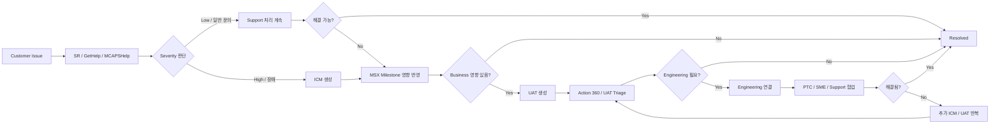

# Microsoft 내부 시스템 정리 (티켓 / 에스컬레이션 / 컨설팅)

Microsoft 내부에서 사용되는 주요 시스템과 역할(PTC)에 대한 정리.
하나의 통합 티켓 시스템이 아니라, 목적별로 분리되어 체인 형태로 연동된다.

---

## 1. 핵심 시스템 4종

### 1) ICM (Incident Management)

- **유형**: Incident 관리
- **용도**: 장애·요청·이슈를 티켓 형태로 관리하는 시스템
- **사용 시점**: 서비스 문제 발생 시 (운영/지원팀이 추적·처리)

### 2) MSX (Microsoft Sales Experience)

- **유형**: 영업 플랫폼
- **용도**: 영업 활동(기회·고객·매출) 통합 관리
- **핵심 기능**:
  - Opportunity / Milestone 관리
  - Sales pipeline 관리
  - 리포트 및 대시보드
- **정의**: 판매 프로세스, 고객 활동, 비즈니스 인사이트를 통합한 판매 플랫폼

### 3) UAT (Unified Action Tracker)

- **유형**: 에스컬레이션
- **용도**: 제품/서비스 이슈, blocker를 엔지니어링 팀에 에스컬레이션
- **특징**:
  - 고객 문제 / 기술 이슈 전달
  - Triage(검토) 후 제품팀 전달
- **정의**: 고객 문제와 기술 피드백을 엔지니어링에 전달해 해결하도록 하는 시스템

### 4) GetHelp

- **유형**: 지원 티켓
- **용도**: 지원 요청(티켓) 생성 도구
  - Capacity 요청
  - Service request 트리거
- **특징**:
  - UAT 이전 단계 또는 병행 사용
  - 폐지 예정 언급 있음 ("GetHelp will be phased out")

---

## 2. 추가 시스템

### 5) Action 360

- **역할**: 기술 이슈 / blocker 에스컬레이션 관리
- **특징**: MSX/UAT와 연결, 엔지니어링 지원·기술 리뷰 요청 처리
- **정의**: MSX milestone blocker를 추적·해결하는 중앙 시스템

### 6) ADO (Azure DevOps)

- **역할**: 작업/개발 트래킹
- **특징**: Task / Work item 관리
- **주의**: UAT 대신 사용은 비권장

### 7) MCAPSHelp

- **역할**: 일반 지원 / 문의 / 티켓 처리
- **특징**:
  - Virtual Agent 기반 지원
  - Escalation mailbox 존재
  - GetHelp 대체/확장 채널

### 8) SR (Service Request)

- **역할**: 공식 고객 지원 요청 (Azure portal 등)
- **특징**:
  - 고객이 직접 생성
  - 이후 ICM / UAT로 확장 가능

---

## 3. 통합 테이블

| 시스템        | 유형          | 주요 용도                     | 사용 시점               | 관계                       |
| ------------- | ------------- | ----------------------------- | ----------------------- | -------------------------- |
| **ICM**       | Incident 관리 | 장애/운영 이슈 처리           | 서비스 문제 발생 시     | 핵심 Incident 시스템       |
| **MSX**       | 영업 플랫폼   | Opportunity / Milestone 관리  | 고객 기회/프로젝트 관리 | UAT, Action 360과 연결     |
| **UAT**       | 에스컬레이션  | 제품/엔지니어링 문제 전달     | Blocker / 기술 문제 시  | MSX 기반으로 생성          |
| **GetHelp**   | 지원 티켓     | 일반 지원 요청 생성           | 기본 문의/요청 시작 시  | SR/ICM/UAT로 연결 가능     |
| **MCAPSHelp** | 지원 채널     | 내부 지원 요청 처리           | GetHelp 대체/확장 채널  | Virtual Agent / 이메일     |
| **Action 360**| 에스컬레이션  | 기술 blocker 추적/해결        | MSX milestone 문제 발생 | UAT와 강하게 연계          |
| **SR**        | 고객 지원     | 공식 고객 요청                | 고객이 직접 요청 시     | 이후 ICM/UAT로 확장        |
| **ADO**       | 작업 관리     | Task / Work item 관리         | 개발/내부 작업 관리     | UAT 대체용은 비권장        |

---

## 4. 역할 기준 그룹

| 구분         | 핵심 시스템                |
| ------------ | -------------------------- |
| 기본 지원    | GetHelp · MCAPSHelp · SR   |
| 장애 대응    | ICM                        |
| 영업 관리    | MSX                        |
| 에스컬레이션 | UAT · Action 360           |
| 개발 관리    | ADO                        |

---

## 5. 실무 흐름 (Mermaid)

---

## 6. PTC (Partner Technical Consultant)

### 정의

- **의미**: Partner Technical Consultant
- **성격**: 사람/역할(Role) + 서비스(Engagement)
- **요약**: 시스템이 아닌 **컨설팅 조직/리소스**

### 핵심 역할

- 기술 상담 (Consultation)
- 아키텍처 설계 지원
- Presales 기술 지원
- 기술 Blocker 제거

### 업무 단계

| 단계  | 역할                      |
| ----- | ------------------------- |
| Plan  | 기술 로드맵 / 준비도 평가 |
| Build | 아키텍처 설계 / 개발 가이드 |
| Sell  | PoC, 데모, 기술 설득 지원 |
| Grow  | 운영 개선 / 확장 지원     |

### 다른 시스템과의 관계

| 요소    | 관계                       |
| ------- | -------------------------- |
| ICM     | PTC 케이스 연결용으로 사용 |
| UAT     | 기술 Escalation과 연결     |
| MSX     | 영업/기회 진행 중 기술 지원 |
| GetHelp | 필요 시 지원 요청 경로     |

### 현업 용어

- **PTC 팀** = 기술 컨설턴트 조직
- **PTC 케이스** = PTC 상담 요청 케이스
- **PTC 사이드** = 파트너 기술 지원 담당 쪽

---

## 7. 핵심 요약

- 단일 "티켓 시스템"이 아니라 **목적별로 분리된 체인 구조**
- ICM → 장애/이슈 처리 시스템
- MSX → 영업 관리 플랫폼
- UAT → 엔지니어링 에스컬레이션 도구
- GetHelp → 지원 요청 티켓 생성 도구
- PTC → 파트너 대상 기술 컨설팅 조직 (시스템 아님)
